# Каталог карт

<!-- Файл создан автоматически: pnpm docs:build. Правки вносите в генератор. -->

Всего карт в базе: **154**. Источник — раздел World of Tanks Generals
на официальной вики Wargaming (пространство имён `Card:`).

Изображения — оригинальные арты карт, скачанные с `wiki.wgcdn.co`.

## Штабы (20)

### Штабы — СССР (9)

| Арт | Карта | Ур. | Характеристики | Особенности | Способности |
| --- | --- | --- | --- | --- | --- |
| 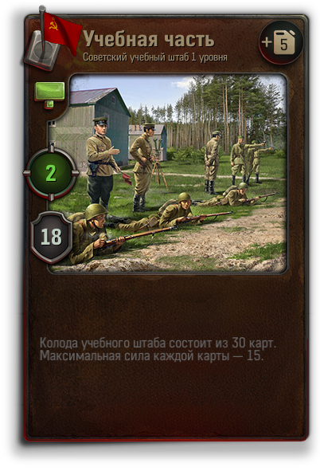 | **Учебная часть** | 1 | атака 2 · прочность 18 · прирост 5 | Учебный | Это базовый советский штаб |
| 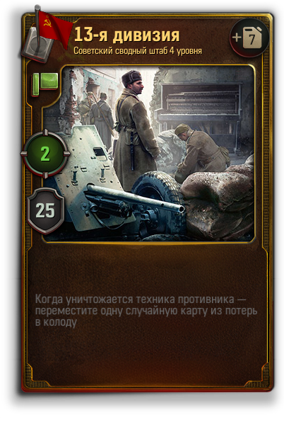 | **13-я дивизия** | 4 | атака 2 · прочность 25 · прирост 7 | Сводный, Премиумная | Когда уничтожается техника противника - переместите одну случайную карту из потерь в колоду. |
| 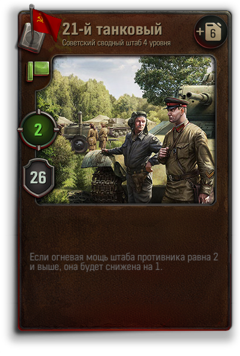 | **21-й танковый** | 4 | атака 2 · прочность 26 · прирост 6 | Сводный | Огневая мощь штаба противника уменьшена на 1, если она должна быть равна 2 или больше. |
| 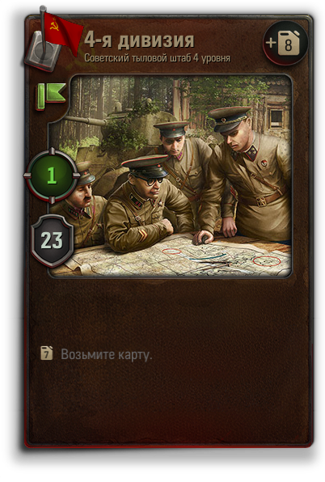 | **4-я дивизия** | 4 | атака 1 · прочность 23 · прирост 8 | Тыловой | Возьмите карту за 7 ресурсов. |
| 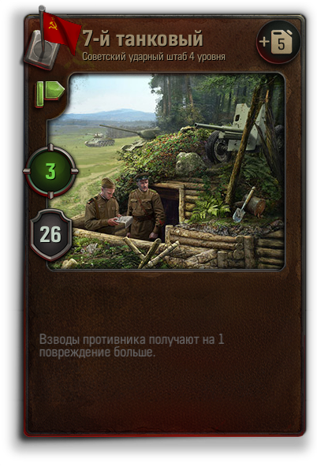 | **7-й танковый** | 4 | атака 3 · прочность 26 · прирост 5 | Ударный | Взводы противника получают на 1 повреждение больше. |
| 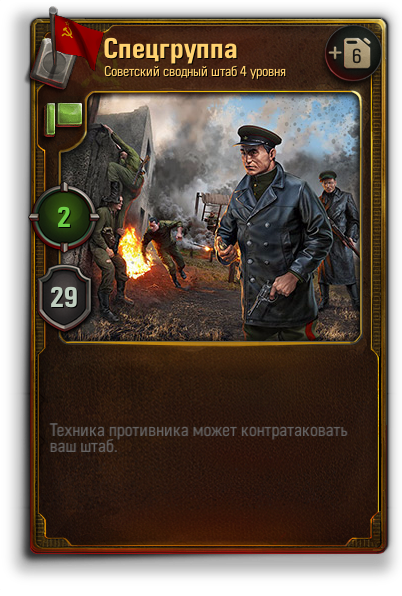 | **Спецгруппа** | 4 | атака 2 · прочность 29 · прирост 6 | Сводный, Подарочная | Техника противника может контратаковать ваш штаб. |
| 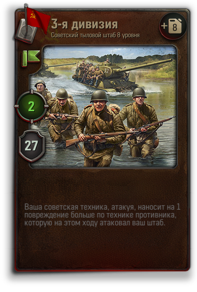 | **3-я дивизия** | 8 | атака 2 · прочность 27 · прирост 8 | Тыловой | Ваша советская техника, атакуя, наносит на 1 повреждение больше по технике противника, которую на этом ходе атаковал ваш штаб. |
| 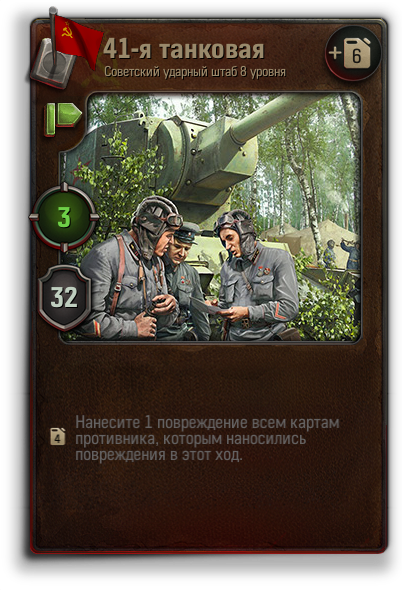 | **41-я танковая** | 8 | атака 3 · прочность 32 · прирост 6 | Ударный | Нанесите 1 повреждение всем картам противника, которым наносились повреждения в этот ход., заплатив 4 ресурса. |
| 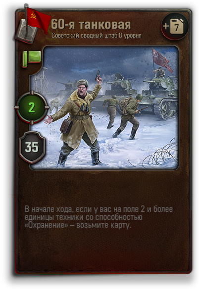 | **60-я танковая** | 8 | атака 2 · прочность 35 · прирост 7 | Сводный | В начале хода, если у вас на поле две и более техники со способностью “Охранение” — возьмите карту. |

### Штабы — Германия (6)

| Арт | Карта | Ур. | Характеристики | Особенности | Способности |
| --- | --- | --- | --- | --- | --- |
| 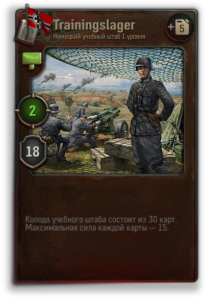 | **Trainingslager** | 1 | атака 2 · прочность 18 · прирост 5 | Учебный | — |
| 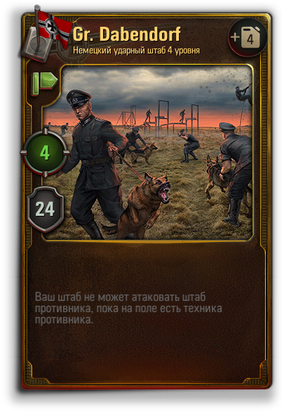 | **Gr. Dabendorf** | 4 | атака 4 · прочность 24 · прирост 4 | Ударный, Подарочная | Ваш штаб не может атаковать штаб противника, пока на поле есть техника противника. |
| 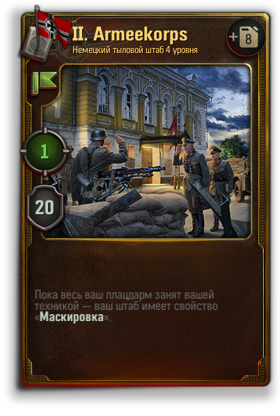 | **II. Armeekorps** | 4 | атака 1 · прочность 20 · прирост 8 | Тыловой, Премиумная | Пока весь ваш плацдарм занят вашей техникой - ваш штаб обладает способностью «Маскировка». |
| 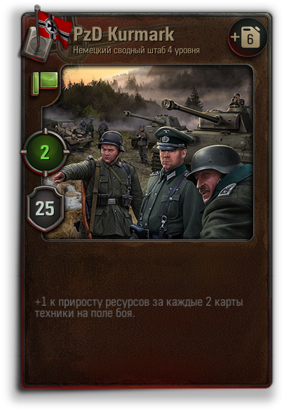 | **PzD Kurmark** | 4 | атака 2 · прочность 25 · прирост 6 | Сводный | +1 к приросту ресурсов за каждые 2 карты техники на поле боя |
| 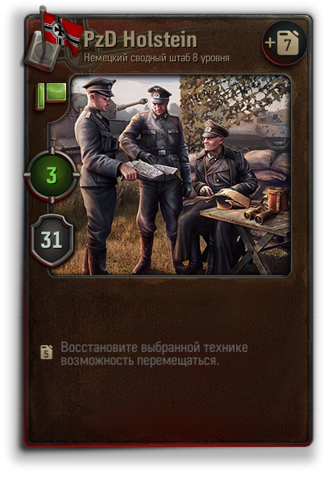 | **PzD Holstein** | 8 | атака 3 · прочность 31 · прирост 7 | Сводный | (за 5 ресурса) Восстановите выбранной технике возможность перемещаться. |
| 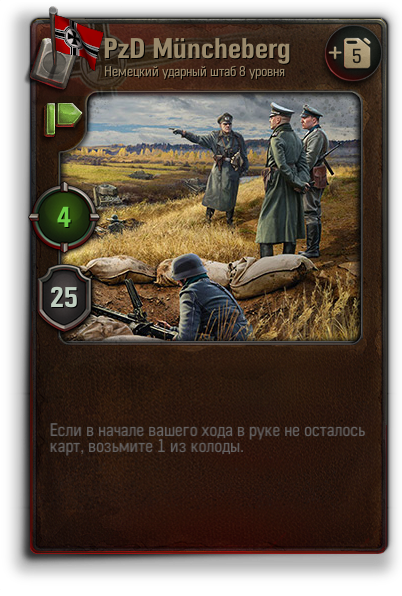 | **PzD Müncheberg** | 8 | атака 4 · прочность 25 · прирост 5 | Ударный | В начале вашего хода, если у вас в руке нет карт — возьмите карту. |

### Штабы — США (5)

| Арт | Карта | Ур. | Характеристики | Особенности | Способности |
| --- | --- | --- | --- | --- | --- |
| 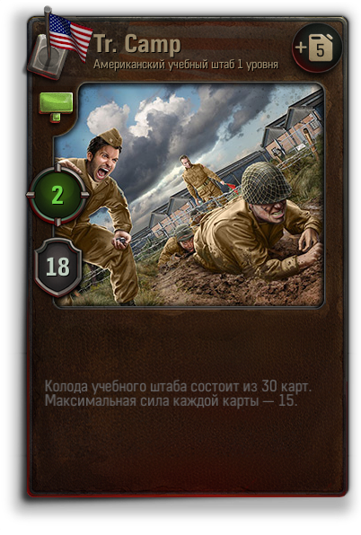 | **Training Camp** | 1 | атака 2 · прочность 18 · прирост 5 | Учебный | Этот штаб имеет высокий прирост ресурсов, позволяющий ему использовать сильные карты, но зато низкую прочность. |
| 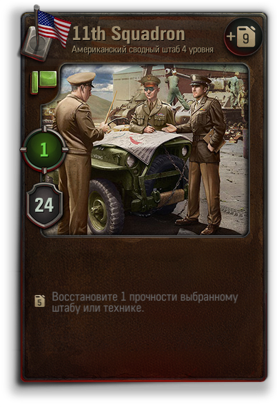 | **11th Squadron** | 4 | атака 1 · прочность 24 · прирост 9 | Сводный | Восстановите 1 единицу прочности, выбранному штабу или технике. За каждую 5 единицу ресурсов. |
| 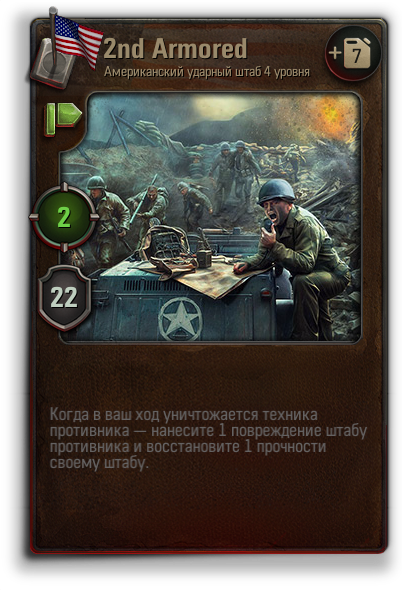 | **2nd Armored** | 4 | атака 2 · прочность 22 · прирост 7 | Ударный | Когда в ваш ход уничтожается техника противника — нанесите 1 повреждение штабу противника и восстановите 1 прочности своему штабу. |
| 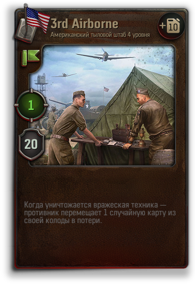 | **3rd Airborne** | 4 | атака 1 · прочность 20 · прирост 10 | Тыловой | Когда уничтожается вражеская техника - противник перемещает 1 случайную карту из своей колоды в потери. |
| 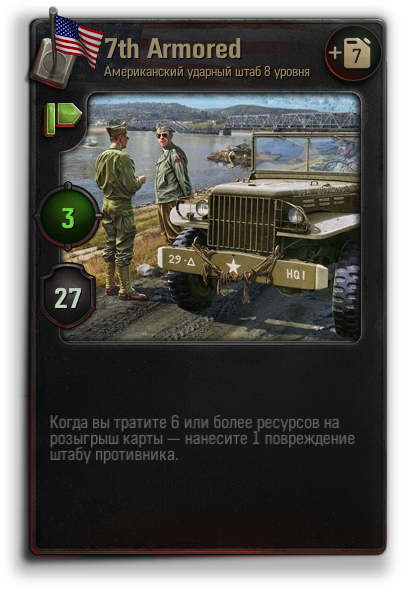 | **7th Armored** | 8 | атака 3 · прочность 27 · прирост 7 | Ударный | Когда вы тратите 6 или более ресурсов на розыгрыш карты — нанесите 2 повреждения штабу противника. |

## Техника (106)

### Техника — СССР (33)

| Арт | Карта | Ур. | Характеристики | Особенности | Способности |
| --- | --- | --- | --- | --- | --- |
| 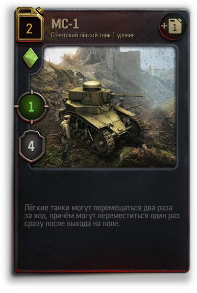 | **МС-1** | 1 | цена 2 · атака 1 · прочность 4 · прирост 1 | Лёгкий танк, Стартовая | — |
| 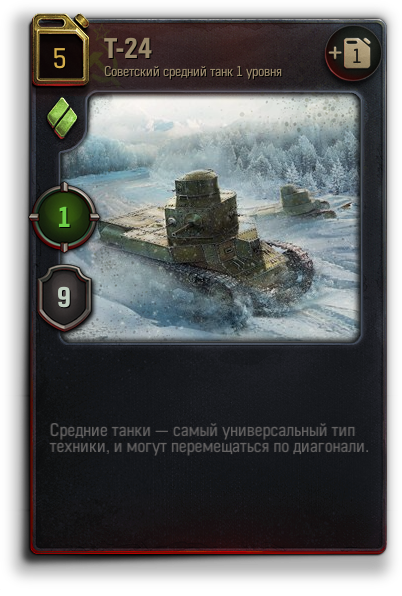 | **Т-24** | 1 | цена 5 · атака 1 · прочность 9 · прирост 1 | Средний танк, Стартовая | — |
| 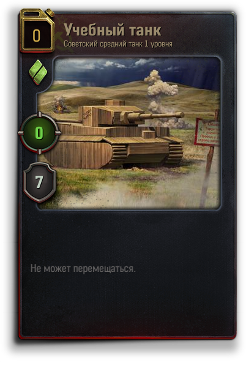 | **Учебный танк** | 1 | цена 0 · атака 0 · прочность 7 · прирост 0 | Средний танк, Учебная | Не может перемещаться. |
| 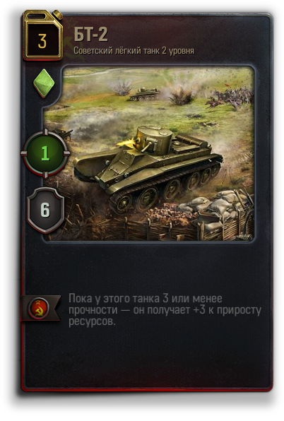 | **БТ-2** | 2 | цена 3 · атака 1 · прочность 6 · прирост 0 _(прирост до 3 со способностью)_ | Лёгкий танк | Пока у этого танка 3 или менее прочности - он получает +3 к приросту ресурсов (только для советских штабов) |
| 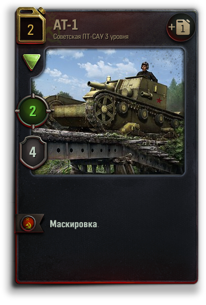 | **АТ-1** | 3 | цена 2 · атака 2 · прочность 4 · прирост 1 | ПТ-САУ, Удалена из игры | Маскировка (на штабах СССР). |
| 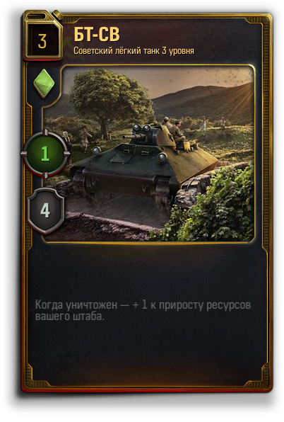 | **БТ-СВ** | 3 | цена 3 · атака 1 · прочность 4 · прирост 0 | Лёгкий танк, Премиумная | Когда уничтожен - +1 к приросту ресурсов вашего штаба. |
| 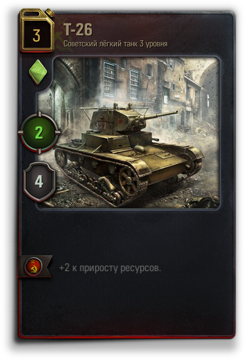 | **Т-26** | 3 | цена 3 · атака 2 · прочность 4 · прирост 0 _(прирост до 2 со способностью)_ | Лёгкий танк | +2 к приросту ресурсов (только для советских штабов) |
| 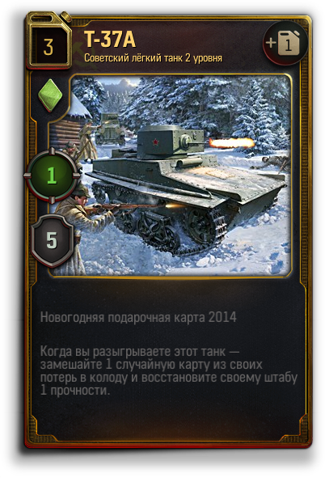 | **Т-37А** | 3 | цена 3 · атака 1 · прочность 5 · прирост 1 | Лёгкий танк, Подарочная | Когда вы разыгрываете этот танк - замешайте одну случайную карту из своих потерь в колоду и восстановите своему штабу 1 прочности. |
| 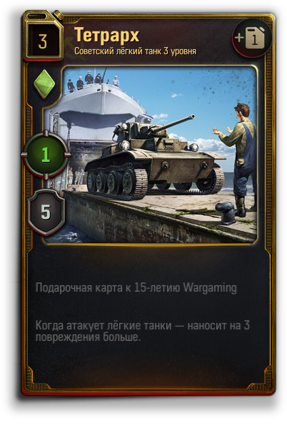 | **Тетрарх** | 3 | цена 3 · атака 1 · прочность 5 · прирост 1 _(атака до 4 со способностью)_ | Лёгкий танк, Подарочная | Когда атакует легкие танки - наносит на 3 повреждения больше. |
| 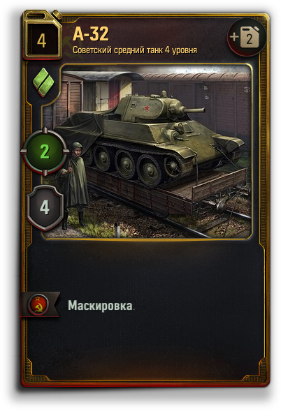 | **А-32** | 4 | цена 4 · атака 2 · прочность 4 · прирост 2 | Средний танк, Премиумная | Национальная особенность:Маскировка. |
| 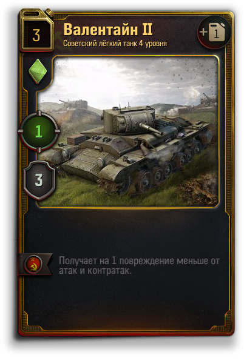 | **Валентайн II** | 4 | цена 3 · атака 1 · прочность 3 · прирост 1 | Лёгкий танк, Премиумная | Получает на 1 повреждение меньше от атак и контратак (на штабах СССР) |
| 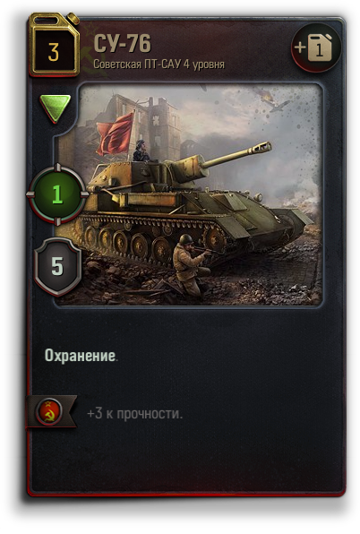 | **СУ-76** | 4 | цена 3 · атака 1 · прочность 5 · прирост 1 _(прочность до 8 со способностью)_ | ПТ-САУ | Охранение +3 к прочности (на штабах СССР) |
| 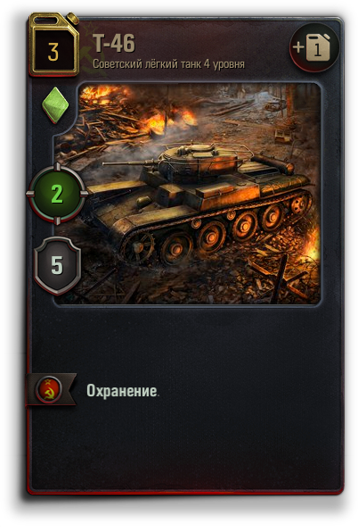 | **Т-46** | 4 | цена 3 · атака 2 · прочность 5 · прирост 1 | Лёгкий танк | Охранение (на штабах СССР). |
| 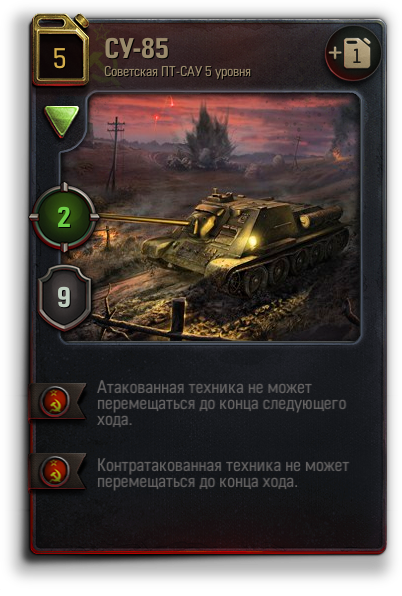 | **СУ-85** | 5 | цена 5 · атака 2 · прочность 9 · прирост 1 | ПТ-САУ | Атакованная техника не может перемещаться в свой следующий ход (на штабах СССР). Контратакованная техника не может перемещаться до конца хода (на штабах СССР). |
| 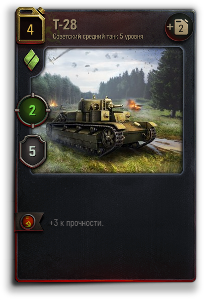 | **Т-28** | 5 | цена 4 · атака 2 · прочность 5 · прирост 2 _(прочность до 8 со способностью)_ | Средний танк | Национальная особенность: +3 к прочности. |
| 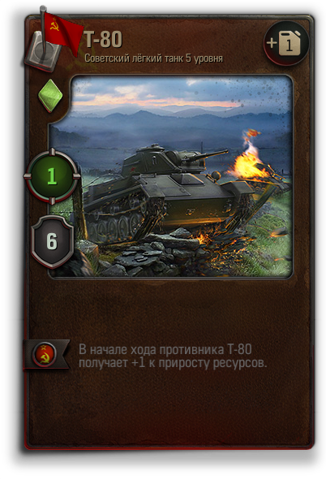 | **Т-80** | 5 | цена 4 · атака 1 · прочность 6 · прирост 1 | Лёгкий танк, Наёмник | В начале хода противника Т-80 получает +1 к приросту ресурсов (на штабах СССР). |
| 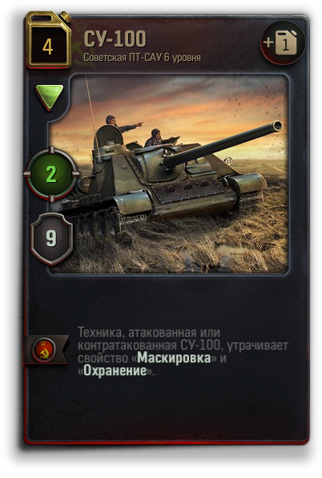 | **СУ-100** | 6 | цена 4 · атака 2 · прочность 9 · прирост 1 | ПТ-САУ | Техника, атакованная или контратакованная СУ-100, утрачивает свойство Маскировка и Охранение (на штабах СССР) |
| 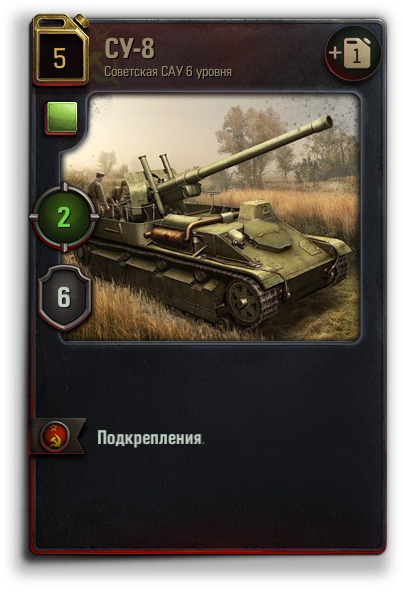 | **СУ-8** | 6 | цена 5 · атака 2 · прочность 6 · прирост 1 | САУ, Наёмник | (только для штабов СССР) Подкрепления. |
| 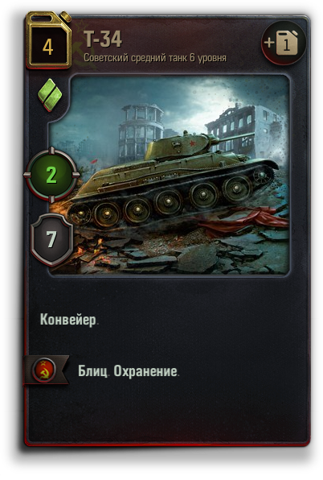 | **Т-34** | 6 | цена 4 · атака 2 · прочность 7 · прирост 1 | Средний танк, Конвейер | Конвейер. Блиц (на штабах СССР). Охранение (на штабах СССР). |
| 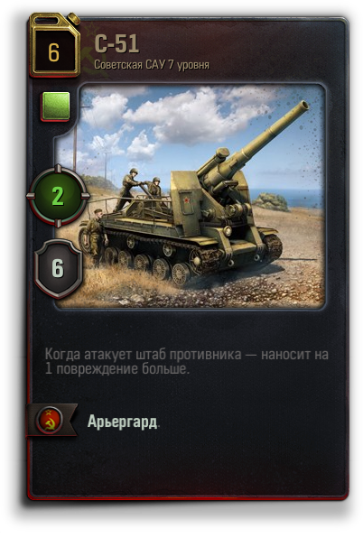 | **С-51** | 7 | цена 6 · атака 2 · прочность 6 · прирост 0 | САУ | Когда атакует штаб противника — наносит на 1 повреждение больше. Арьергард (на штабах СССР) |
| 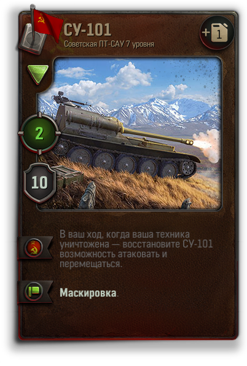 | **СУ-101** | 7 | цена 5 · атака 2 · прочность 10 · прирост 1 | ПТ-САУ | Национальная особенность: Способность активная на сводных штабах: Маскировка |
| 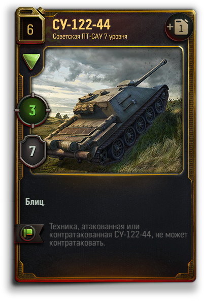 | **СУ-122-44** | 7 | цена 6 · атака 3 · прочность 7 · прирост 1 | ПТ-САУ, Подарочная | Техника, атакованная или контратакованная СУ-122-44, не может контратаковать. Способность активная на сводных штабах. Блиц. |
| 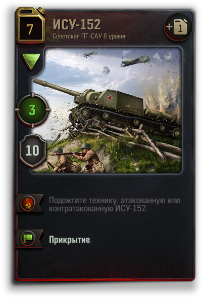 | **ИСУ-152** | 8 | цена 7 · атака 3 · прочность 10 · прирост 1 | ПТ-САУ, Наёмник | Подожгите технику, атакованную или контратакованную ИСУ-152 (на штабах СССР). Способность активная на сводных штабах. Прикрытие. |
| 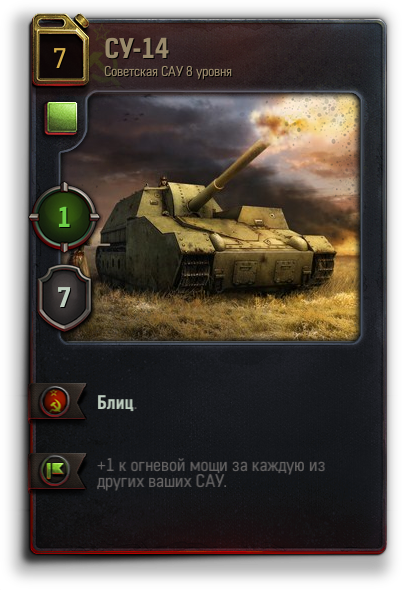 | **СУ-14** | 8 | цена 7 · атака 1 · прочность 7 · прирост 0 | САУ | Блиц (на штабах СССР). + 1 к огневой мощи за каждую из других ваших САУ (на тыловых штабах). |
| 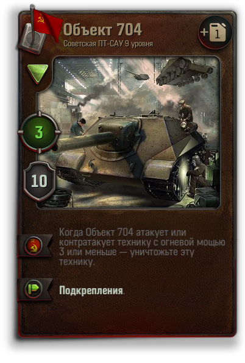 | **Объект 704** | 9 | цена 6 · атака 3 · прочность 10 · прирост 1 | ПТ-САУ | Когда Объект 704 атакует или контратакует технику с прочностью 3 или меньше - уничтожьте эту технику. (на штабах СССР) Подкрепления (на ударных штабах) |
| 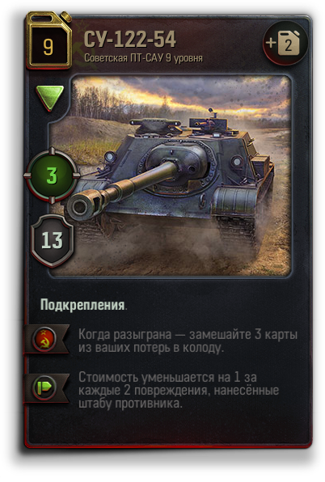 | **СУ-122-54** | 9 | цена 9 · атака 3 · прочность 13 · прирост 2 | ПТ-САУ, Наёмник | Подкрепления Национальная особенность: Когда разыграна — замешайте 3 карты из ваших потерь в колоду. Способность активная на ударных штабах:Стоимость уменьшается на 2 за каждое повреждение, нанесённое штабу противника. |
| 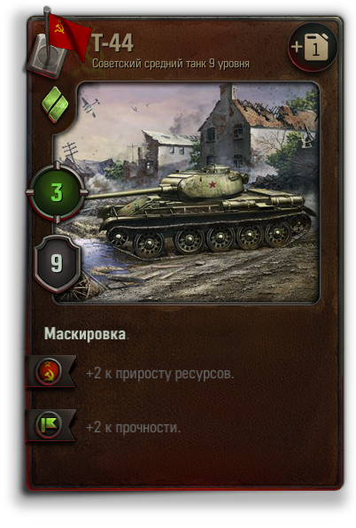 | **Т-44** | 9 | цена 7 · атака 3 · прочность 9 · прирост 1 _(прочность до 11 со способностью, прирост до 3 со способностью)_ | Средний танк | Маскировка. +2 к приросту ресурсов (на штабах СССР). +2 к прочности (на тыловых штабах). |
| 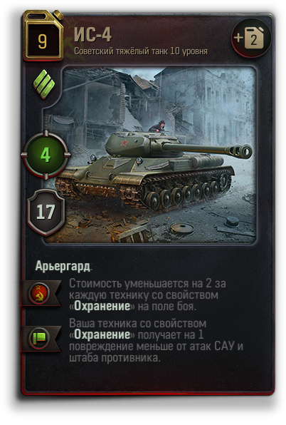 | **ИС-4** | 10 | цена 9 · атака 4 · прочность 17 · прирост 2 | Тяжёлый танк, Наёмник | Арьергард Национальная особенность: Стоимость уменьшается на 2 за каждую технику со свойством Охранение на поле боя. Способность активная на сводных штабах: Ваша техника со свойством Охранение получает на 1 повреждение меньше от атак САУ и штаба противника. |
| 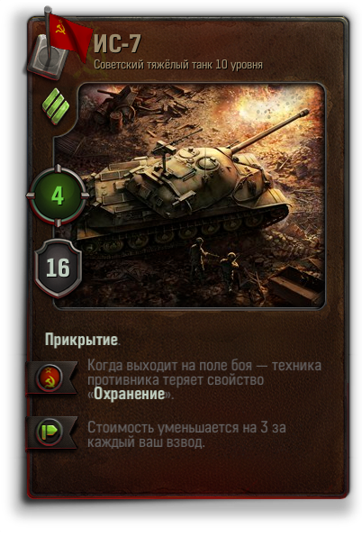 | **ИС-7** | 10 | цена 9 · атака 4 · прочность 16 · прирост 0 | Тяжёлый танк, Наёмник | Прикрытие. Когда выходит на поле боя — техника противника теряет свойство Охранение (на штабах СССР). Стоимость уменьшается на 3 за каждый ваш взвод (на ударных штабах). |
| 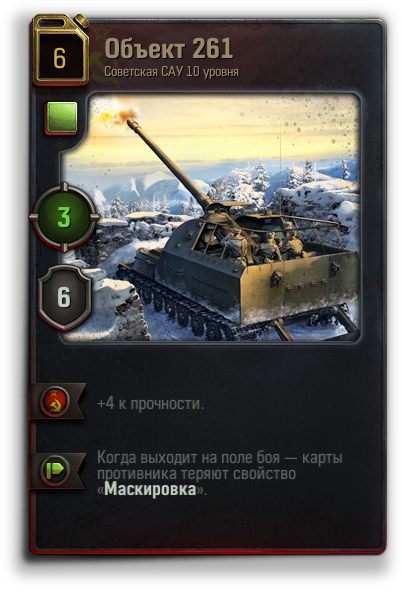 | **Объект 261** | 10 | цена 6 · атака 3 · прочность 6 · прирост 0 _(прочность до 10 со способностью)_ | САУ | +4 к прочности (на штабах СССР). Когда выходит на поле боя — карты противника теряют свойство Маскировка (на ударных штабах). |
| 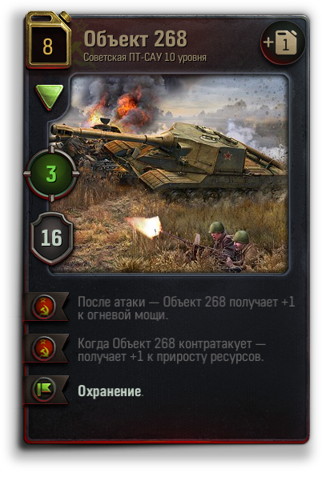 | **Объект 268** | 10 | цена 8 · атака 3 · прочность 16 · прирост 1 | ПТ-САУ | После атаки - Объект 268 получает +1 к огневой мощи(на штабах СССР). Когда Объект 268 контратакует - получает +1 к приросту ресурсов(на штабах СССР) Охранение (на тыловых штабах). |
| 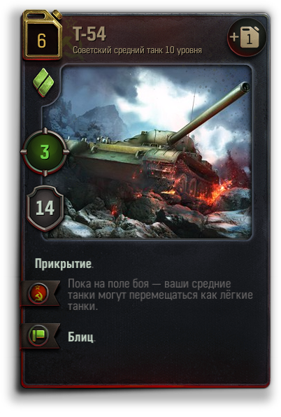 | **Т-54** | 10 | цена 6 · атака 3 · прочность 14 · прирост 1 | Средний танк | Прикрытие. Пока на поле боя - ваши Средние Танки могут перемещаться как Легкие Танки (на штабах СССР). Блиц (на сводных штабах). |
| 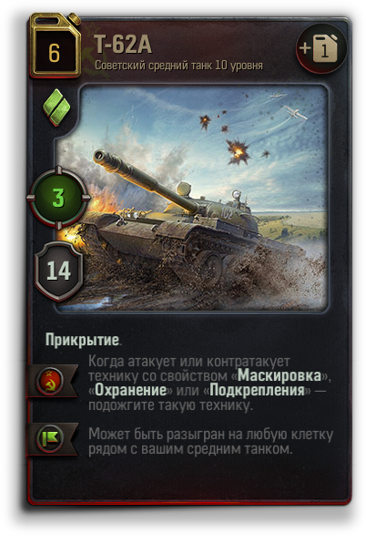 | **T-62А** | 10 | цена 6 · атака 3 · прочность 14 · прирост 1 | Средний танк | Прикрытие Национальная особенность: Когда атакует или контратакует технику со свойством Маскировка, Охранение или Подкрепление — подожгите такую технику. Способность активная на тыловых штабах: Может быть разыгран на любую клетку рядом с вашим средним танком. |

### Техника — Германия (39)

| Арт | Карта | Ур. | Характеристики | Особенности | Способности |
| --- | --- | --- | --- | --- | --- |
| 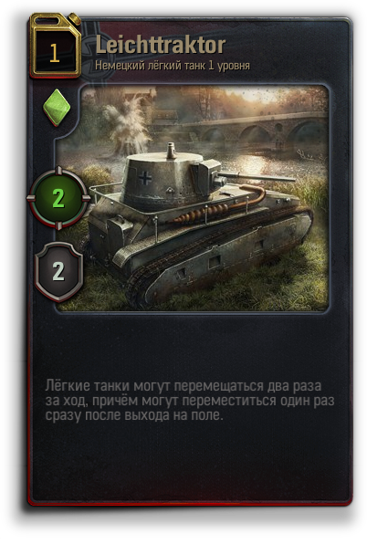 | **Leichttraktor** | 1 | цена 1 · атака 2 · прочность 2 · прирост 0 | Лёгкий танк | — |
| 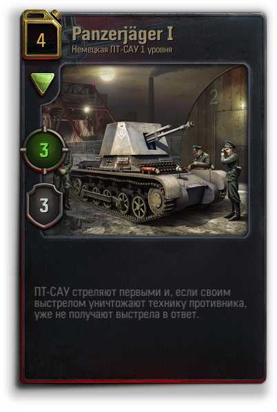 | **Panzerjäger I** | 1 | цена 4 · атака 3 · прочность 3 · прирост 0 | ПТ-САУ, Удалена из игры | ПТ-САУ стреляют первыми,и если своим выстрелом уничтожают технику противника, уже не получают выстрела в ответ. |
| 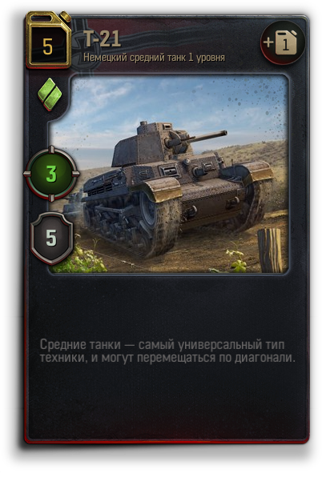 | **T-21** | 1 | цена 5 · атака 3 · прочность 5 · прирост 1 | Средний танк, Стартовая | Средние танки - самый универсальный тип техники, и могут передвигаться по диагонали. |
| 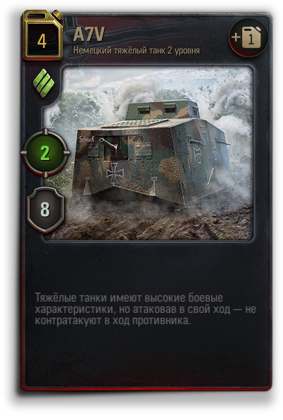 | **A7V** | 2 | цена 4 · атака 2 · прочность 8 · прирост 1 | Тяжёлый танк | Тяжелые танки имеют высокие боевые характеристики, но, атаковав в свой ход, не контратакуют в ход противника. |
| 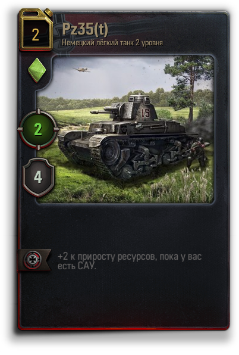 | **Pz35(t)** | 2 | цена 2 · атака 2 · прочность 4 · прирост 0 | Лёгкий танк | Для немецких штабов: +2 к приросту ресурсов пока у вас есть САУ (на поле) |
|  | **Pz35(t)** | 2 | цена 2 · атака 2 · прочность 4 · прирост 0 | Лёгкий танк | Для немецких штабов: +2 к приросту ресурсов пока у вас есть САУ (на поле) |
| 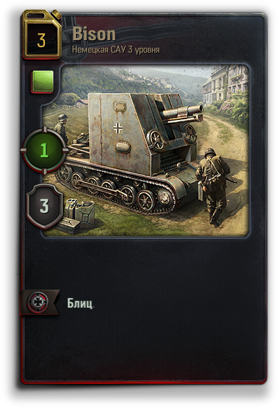 | **Bison** | 3 | цена 3 · атака 1 · прочность 3 · прирост 0 | САУ | (только для немецких штабов) Блиц |
| 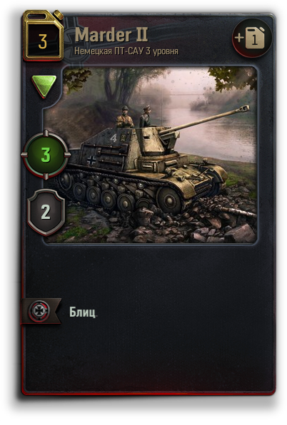 | **Marder II** | 3 | цена 3 · атака 3 · прочность 2 · прирост 1 | ПТ-САУ | (только для немецких штабов) Блиц |
| 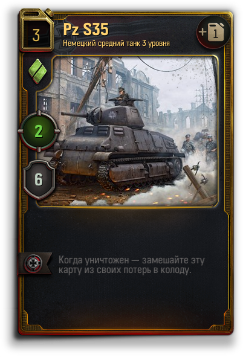 | **Pz S35** | 3 | цена 3 · атака 2 · прочность 6 · прирост 1 | Средний танк, Премиумная | Когда уничтожен - замешайте эту карту из своих потерь в колоду. |
| 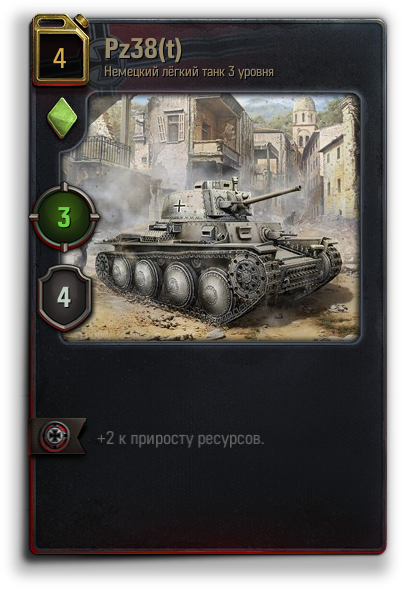 | **Pz38(t)** | 3 | цена 4 · атака 3 · прочность 4 · прирост 0 | Лёгкий танк | (только для немецких штабов) +2 к приросту ресурсов |
| 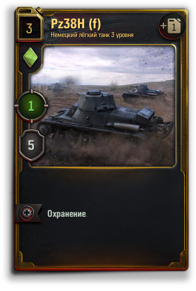 | **Pz38H (f)** | 3 | цена 3 · атака 1 · прочность 5 · прирост 1 | Лёгкий танк, Премиумная | (только для немецких штабов) Охранение |
| 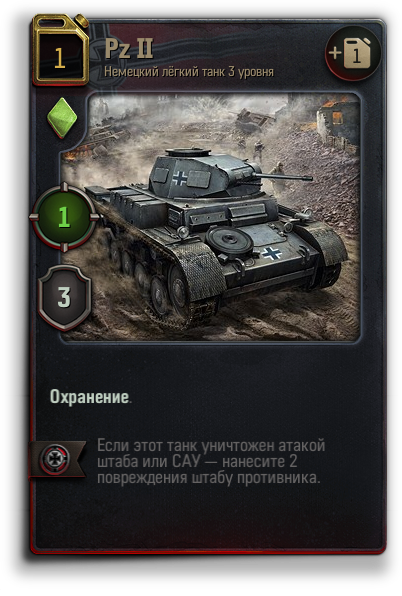 | **PzKpfw II** | 3 | цена 1 · атака 1 · прочность 2 · прирост 1 | Лёгкий танк | Охранение (только для немецких штабов) Если этот танк уничтожен атакой штаба или САУ - нанесите 2 повреждения штабу противника. |
| 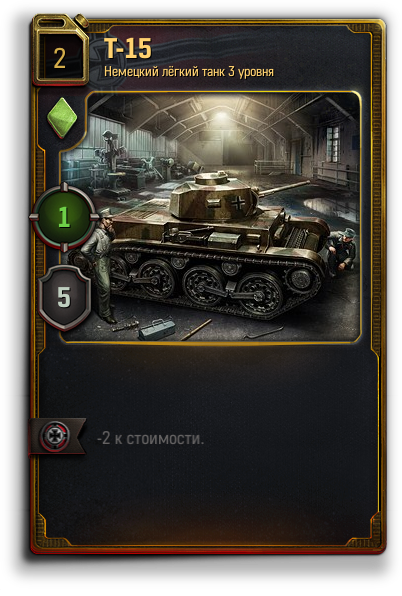 | **T-15** | 3 | цена 2 · атака 1 · прочность 5 · прирост 0 | Лёгкий танк, Премиумная | (только для немецких штабов) -2 к стоимости. |
| 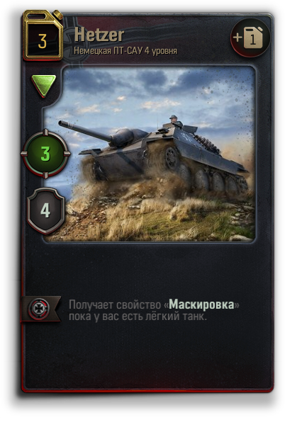 | **Hetzer** | 4 | цена 3 · атака 3 · прочность 4 · прирост 1 | ПТ-САУ | (только для немецких штабов) Получает способность маскировка, пока у Вас есть легкий танк. |
| 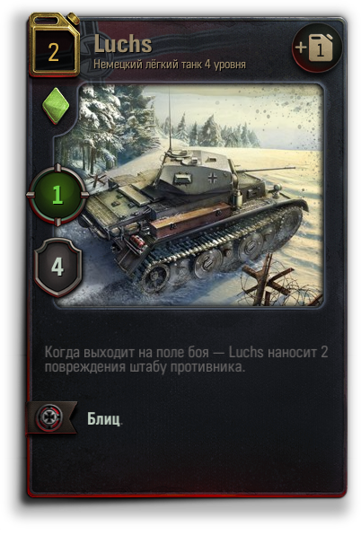 | **Luchs** | 4 | цена 2 · атака 1 · прочность 4 · прирост 1 | Лёгкий танк, Наёмник | Когда выходит на поле боя - Luchs наносит 2 повреждения штабу противника. (только для немецких штабов) Блиц |
| 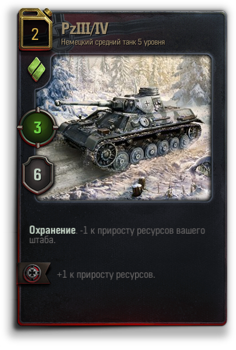 | **PzIII/IV** | 5 | цена 2 · атака 3 · прочность 6 · прирост -1 | Средний танк, Наёмник | Охранение (только для немецких штабов) +1 к приросту ресурсов. |
| 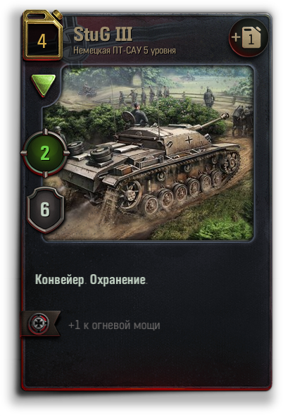 | **StuG III** | 5 | цена 4 · атака 2 · прочность 6 · прирост 1 | ПТ-САУ, Конвейер | Конвейер. Охранение. (только для немецких штабов) +1 к огневой мощи. |
| 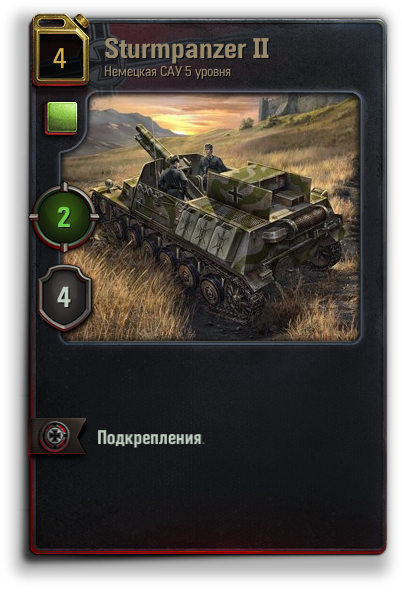 | **Sturmpanzer II** | 5 | цена 4 · атака 2 · прочность 4 | САУ | (только для немецких штабов) Подкрепления |
| 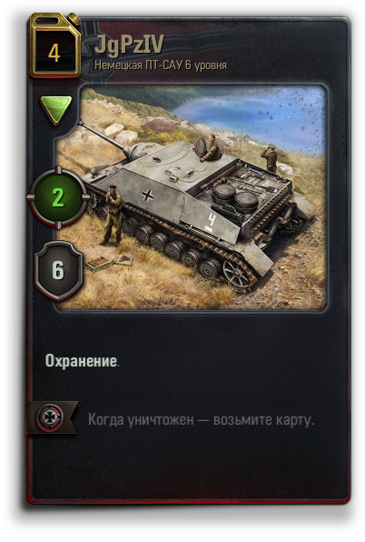 | **JagdPz IV** | 6 | цена 4 · атака 2 · прочность 6 · прирост 0 | ПТ-САУ | Охранение (только для немецких штабов) Когда уничтожен - возьмите карту |
| 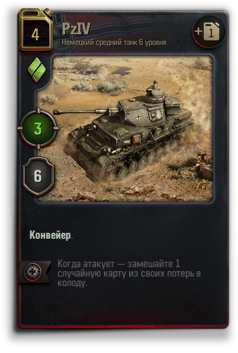 | **PzKpfw IV** | 6 | цена 4 · атака 3 · прочность 6 · прирост 1 | Средний танк, Конвейер | Конвейер (только для немецких штабов) Когда атакует - замешайте одну случайную карту из своих потерь в колоду. |
| 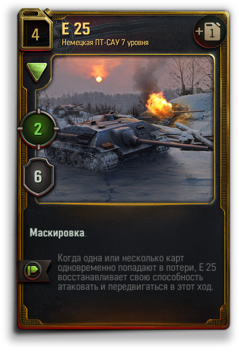 | **E25** | 7 | цена 4 · атака 2 · прочность 6 · прирост 1 | ПТ-САУ, Подарочная | Маскировка. Способность активная на ударных штабах: Когда одна или несколько карт одновременно попадают в потери, E 25 восстанавливает свою способность атаковать и передвигаться в этот ход. |
| 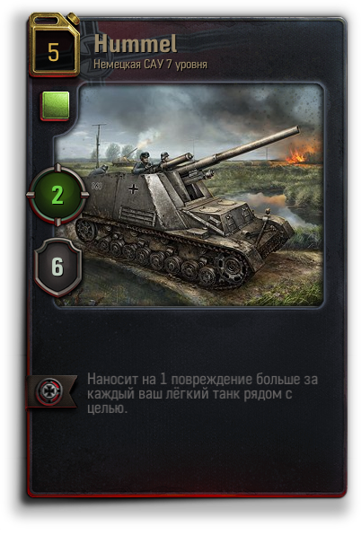 | **Hummel** | 7 | цена 5 · атака 2 · прочность 6 · прирост 0 | САУ, Наёмник | (только для немецких штабов) Наносит на 1 повреждение больше за каждый ваш лёгкий танк рядом с целью. |
| 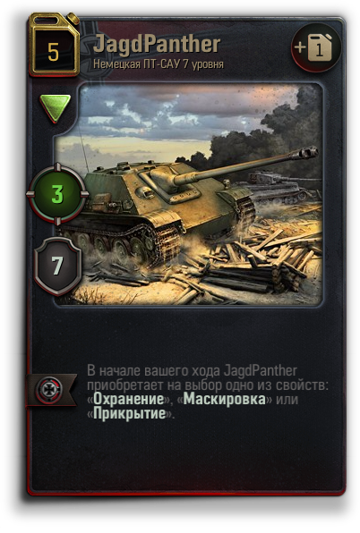 | **JagdPanther** | 7 | цена 5 · атака 3 · прочность 7 · прирост 1 | ПТ-САУ | (только для немецких штабов) В начале Вашего хода JagdPanther приобретает на выбор одну из способностей Охранение, Маскировка или Прикрытие. |
| 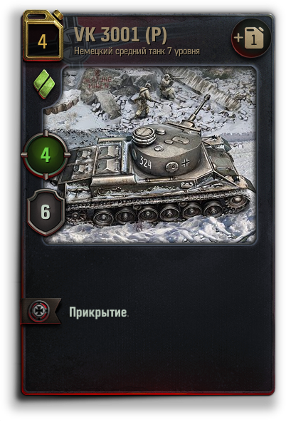 | **VK 3001 (P)** | 7 | цена 4 · атака 4 · прочность 6 · прирост 1 | Средний танк | (только для немецких штабов) Прикрытие |
| 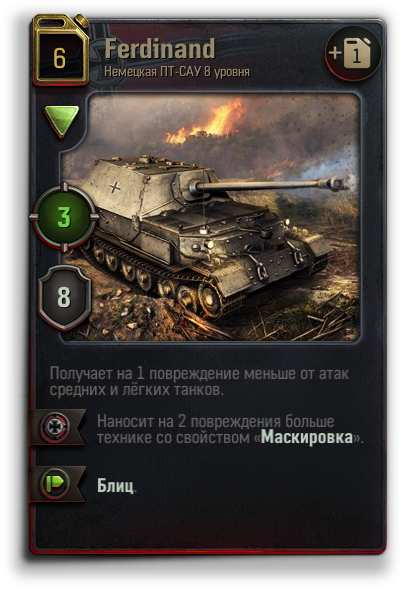 | **Ferdinand** | 8 | цена 6 · атака 3 · прочность 8 · прирост 1 | ПТ-САУ | Получает на 1 повреждение меньше от атак легких и средних танков. (только для немецких штабов) Нанесите на 2 повреждения больше технике со способностью маскировка (только для ударных штабов) Блиц |
| 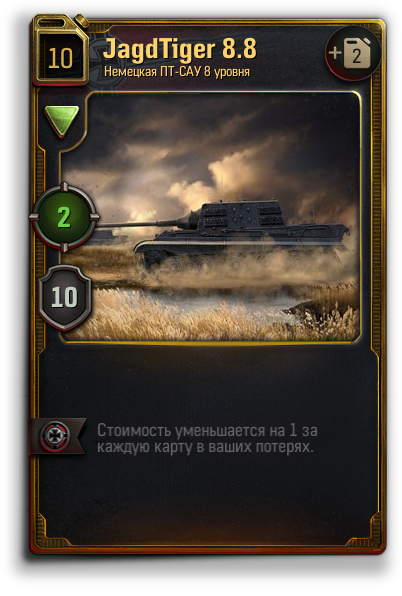 | **JagdTiger 8.8** | 8 | цена 10 · атака 2 · прочность 10 · прирост 2 | ПТ-САУ, Премиумная | (только для немецких штабов) Стоимость уменьшается на 1 за каждую карту в ваших потерях |
| 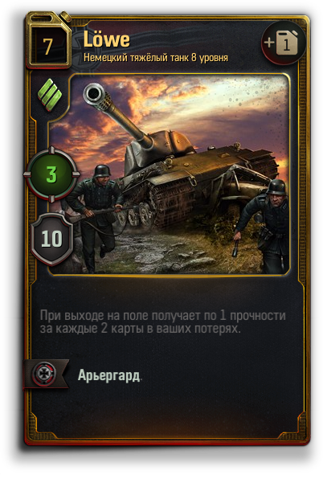 | **Löwe** | 8 | цена 8 · атака 3 · прочность 10 · прирост 1 | Тяжёлый танк, Премиумная | При выходе на поле получает по 1 прочности за каждые 2 карты в ваших потерях. (только для немецких штабов) Арьергард |
| 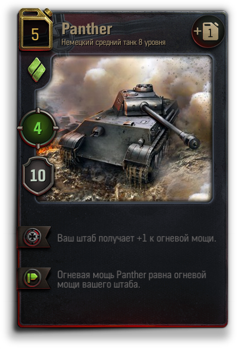 | **Panther** | 8 | цена 5 · атака 4 · прочность 10 · прирост 1 | Средний танк | (только для немецких штабов) Ваш штаб получает +1 к огневой мощи. (только для ударных штабов) Огневая мощь Panther равна огневой мощи Вашего штаба. |
| 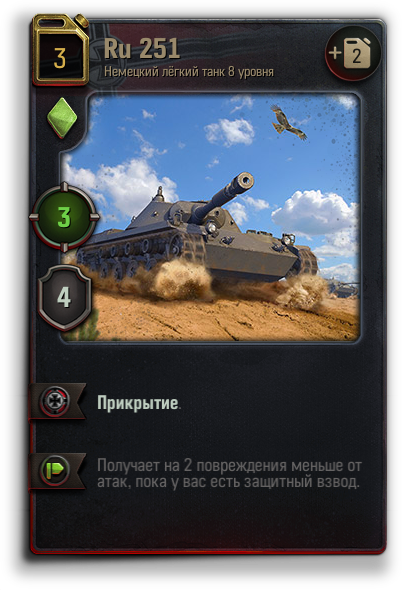 | **Ru 251** | 8 | цена 3 · атака 3 · прочность 4 · прирост 2 | Лёгкий танк | Национальная особенность: Прикрытие Способность активная на ударных штабах: Получает на 2 повреждения меньше от атак, пока у вас есть защитный взвод. |
| 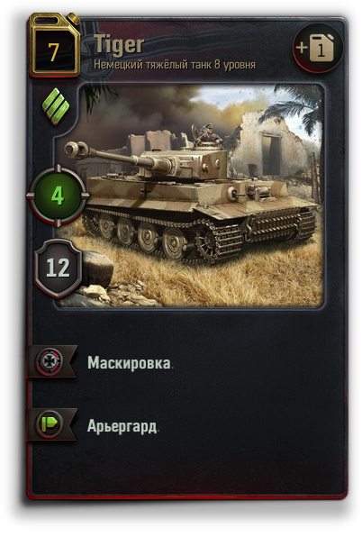 | **Tiger** | 8 | цена 7 · атака 4 · прочность 12 · прирост 1 | Тяжёлый танк, Наёмник | (только для ударных штабов) Арьергард (только для немецких штабов) Маскировка |
| 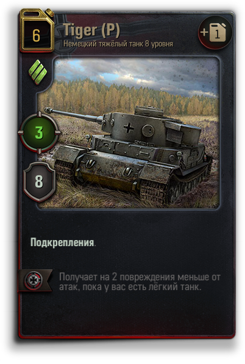 | **Tiger (P)** | 8 | цена 6 · атака 3 · прочность 8 · прирост 1 | Тяжёлый танк, Наёмник | Подкрепления Национальная особенность: Получает на 2 повреждения меньше от атак, пока у вас есть лёгкий танк. |
| 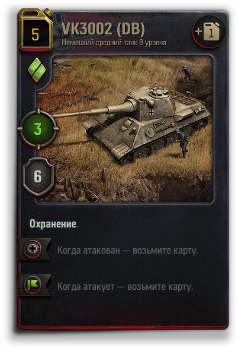 | **VK 3002 (DB)** | 8 | цена 5 · атака 3 · прочность 6 · прирост 1 | Средний танк | (только для немецких штабов) Когда атакован - возьмите карту. (только для тыловых штабов) Когда атакует - возьмите карту. |
| 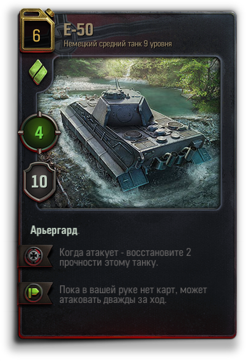 | **E-50** | 9 | цена 6 · атака 4 · прочность 10 | Средний танк | Арьергард Национальная особенность: Когда атакует - восстановите 2 прочности этому танку. Способность активная на ударных штабах: Пока в вашей руке нет карт, может атаковать дважды за ход. |
| 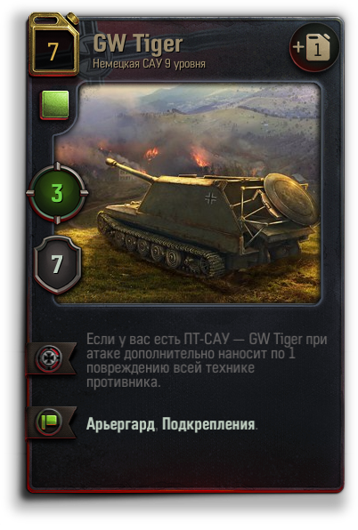 | **GW Tiger** | 9 | цена 7 · атака 3 · прочность 7 · прирост 1 | САУ | (только для немецких штабов) Если у вас есть ПТ-САУ — GW Tiger при атаке дополнительно наносит по 1 повреждению всей технике противника. (только для сводных штабов) Арьергард (только для сводных штабов) Подкрепления |
| 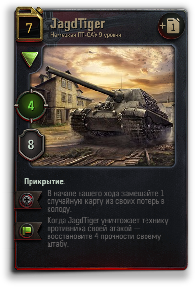 | **JagdTiger** | 9 | цена 7 · атака 4 · прочность 8 · прирост 1 | ПТ-САУ | Прикрытие (только для немецких штабов) В начале вашего хода замешайте 1 случайную карту из своих потерь в колоду. (только для сводных штабов) Когда JagdTiger уничтожает технику противника своей атакой — восстановите 4 прочности своему штабу. |
| 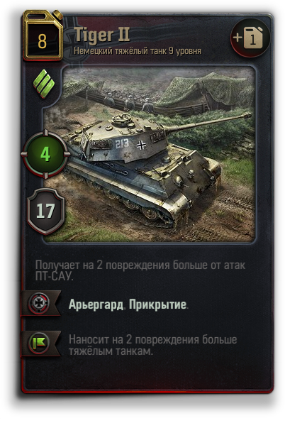 | **Tiger II** | 9 | цена 8 · атака 4 · прочность 17 · прирост 1 | Тяжёлый танк | Получает на 2 повреждения больше от атак ПТ-САУ (только для немецких штабов) Арьергард (только для немецких штабов) Прикрытие (только для тыловых штабов) Наносит на 2 повреждения больше тяжелым танкам |
| 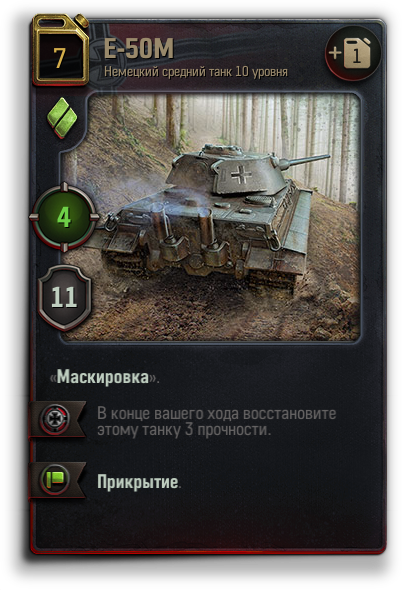 | **E-50M** | 10 | цена 7 · атака 4 · прочность 11 · прирост 1 | Средний танк | Маскировка Национальная особенность: В конце вашего хода восстановите танку E50M 3 прочности. Способность активная на сводных штабах: Прикрытие |
| 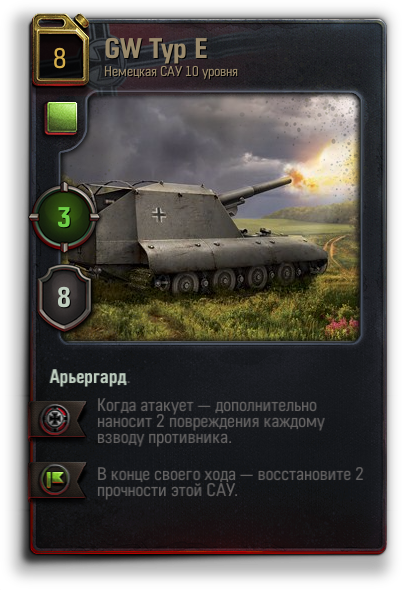 | **GW Typ E** | 10 | цена 8 · атака 3 · прочность 8 · прирост 0 | САУ | Арьергард (только для немецких штабов) Когда атакует — дополнительно наносит 2 повреждения каждому взводу противника. (только для тыловых штабов) В конце своего хода - восстановите 2 прочности этой САУ. |
| 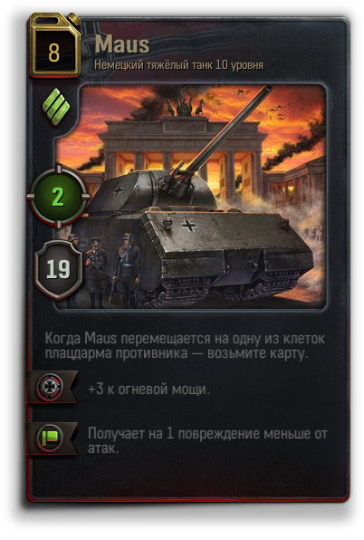 | **Maus** | 10 | цена 8 · атака 2 · прочность 19 · прирост 0 | Тяжёлый танк, Наёмник | Когда Maus перемещается на одну из клеток плацдарма противника — возьмите карту. (только для немецких штабов) +3 к огневой мощи. (только для сводных штабов) Получает на 1 повреждение меньше от атак. |

### Техника — США (34)

| Арт | Карта | Ур. | Характеристики | Особенности | Способности |
| --- | --- | --- | --- | --- | --- |
| 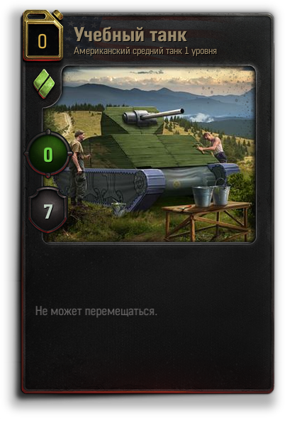 | **Учебный танк** | 1 | цена 0 · атака 0 · прочность 7 · прирост 0 | Средний танк | Не может перемещаться. |
| 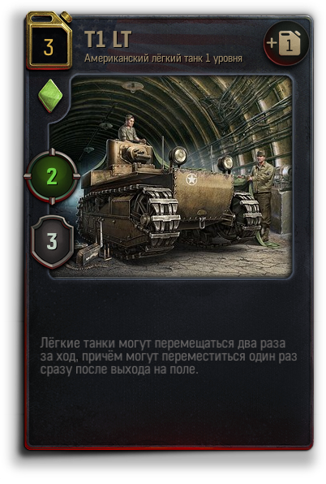 | **T1 LT** | 1 | цена 3 · атака 2 · прочность 3 · прирост 1 | Лёгкий танк, Стартовая | Лёгкие танки могут передвигаться два раза за ход, причём могут переместиться один раз сразу после выхода на поле. |
| 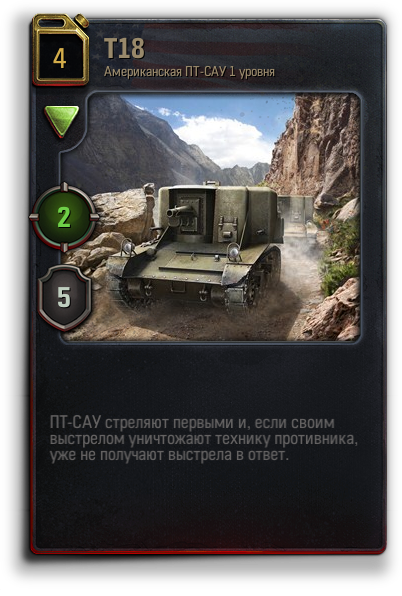 | **T18** | 1 | цена 4 · атака 2 · прочность 5 | ПТ-САУ, Удалена из игры | ПТ-САУ стреляют первыми, и если они своим выстрелом уничтожают технику противника, уже не получают выстрела в ответ. |
| 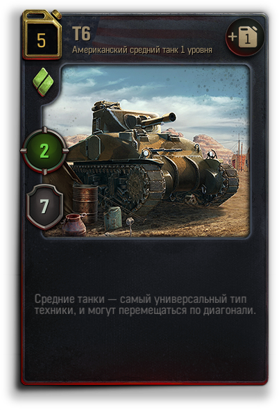 | **T6** | 1 | цена 5 · атака 2 · прочность 7 · прирост 1 | Средний танк, Стартовая | Средние танки - самый универсальный тип техники, и могут передвигаться по диагонали. |
| 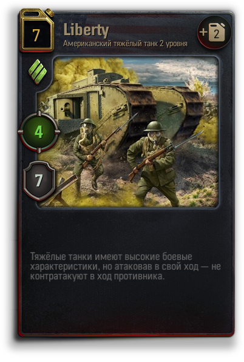 | **Liberty** | 2 | цена 7 · атака 4 · прочность 7 · прирост 2 | Тяжёлый танк | Тяжелые танки имеют высокие боевые характеристики, но атаковав в свой ход - не контратакует в ход противника. |
| 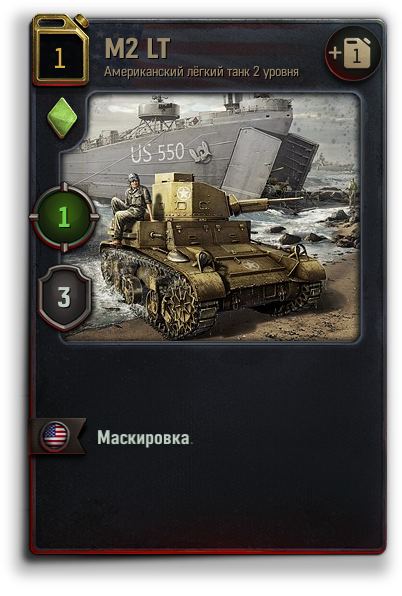 | **M2 LT** | 2 | цена 1 · атака 1 · прочность 3 · прирост 1 | Лёгкий танк | Национальная способность: Маскировка. |
| 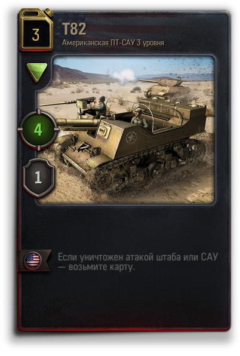 | **Т82** | 3 | цена 3 · атака 4 · прочность 1 | ПТ-САУ | Национальная способность: Если уничтожен атакой штаба или САУ - возьмите карту. |
| 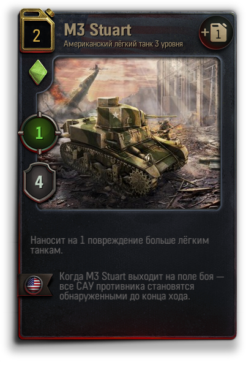 | **M3 Stuart** | 3 | цена 2 · атака 1 · прочность 4 · прирост 1 | Лёгкий танк | Наносит на 1 повреждение больше лёгким танкам. Национальная способность: Когда M3 Stuart выходит на поле боя - все САУ противника становятся обнаруженными. |
| 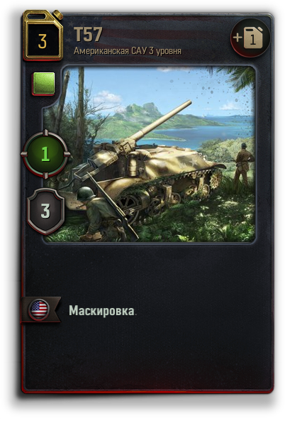 | **T57** | 3 | цена 3 · атака 1 · прочность 3 · прирост 1 | САУ | Национальная способность: Маскировка. |
| 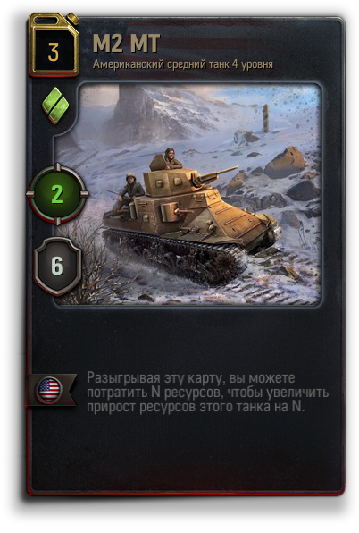 | **M2 MT** | 4 | цена 3 · атака 2 · прочность 6 | Средний танк, Наёмник | Национальная способность: Разыграв эту карту вы можете потратить N ресурсов, чтобы увеличить прирост ресурсов этого танка на N |
| 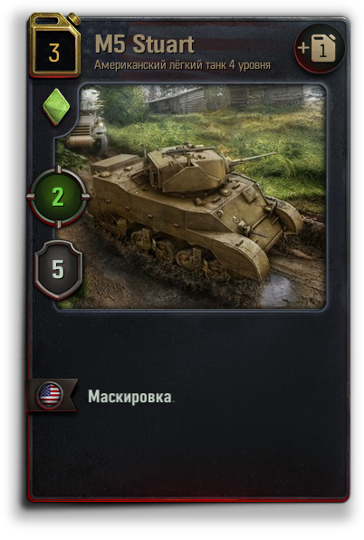 | **M5 Stuart** | 4 | цена 3 · атака 2 · прочность 5 · прирост 1 | Лёгкий танк | Национальная способность: Маскировка. |
| 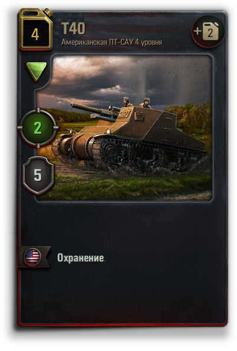 | **T40** | 4 | цена 4 · атака 2 · прочность 5 · прирост 2 | ПТ-САУ | Национальная способность: Охранение. |
| 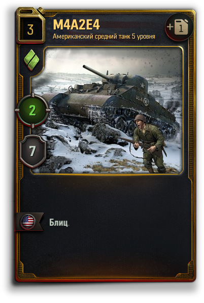 | **M4A2E4** | 5 | цена 3 · атака 2 · прочность 7 · прирост 1 | Средний танк, Премиумная | Национальная способность: Блиц. |
| 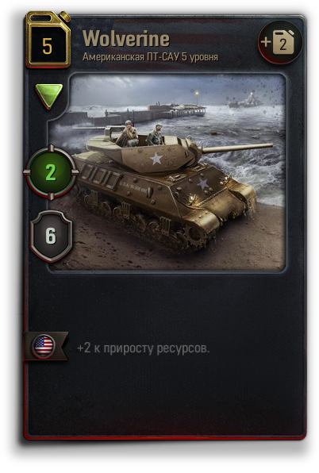 | **Wolverine** | 5 | цена 5 · атака 2 · прочность 6 · прирост 2 | ПТ-САУ | Национальная способность: +2 к приросту ресурсов. |
| 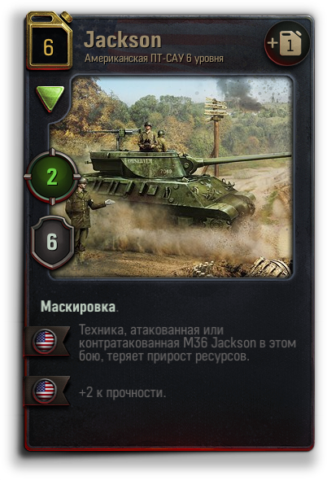 | **Jackson** | 6 | цена 6 · атака 2 · прочность 6 · прирост 1 | ПТ-САУ | Маскировка. Национальная способность: Техника, атакованная или контратакованная M36 Jackson в этом бою, теряет прирост ресурсов. Национальная способность: +2 к прочности. |
| 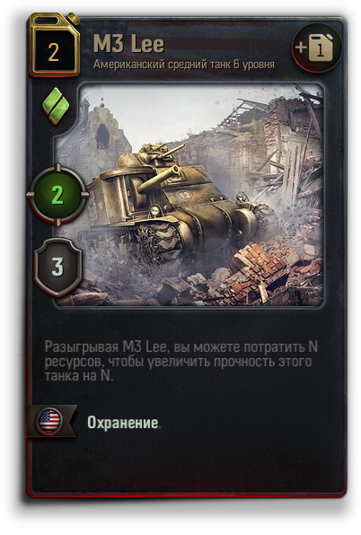 | **M3 Lee** | 6 | цена 2 · атака 2 · прочность 3 · прирост 1 | Средний танк | Разыгрывая эту карту, вы можете потратить N ресурсов, чтобы увеличить прочность этого танка на N. Национальная способность: Охранение. |
| 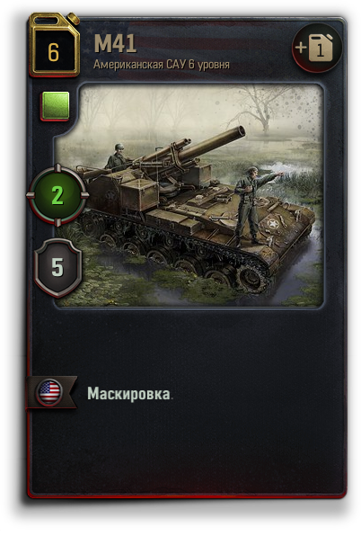 | **M41** | 6 | цена 6 · атака 2 · прочность 5 · прирост 1 | САУ | Национальная способность: Маскировка. |
| 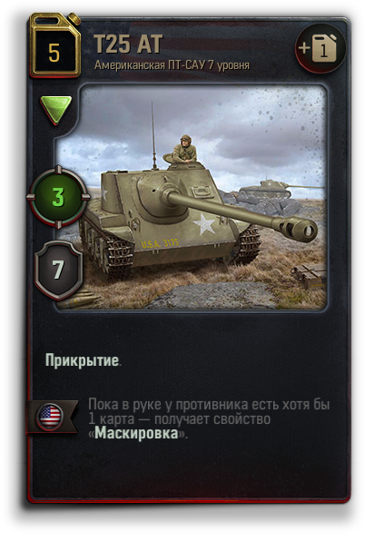 | **Т25 AT** | 7 | цена 5 · атака 3 · прочность 7 · прирост 1 | ПТ-САУ | Прикрытие. Национальная способность: Пока в руке у противника есть хотя бы 1 карта — получает свойство «Маскировка». |
| 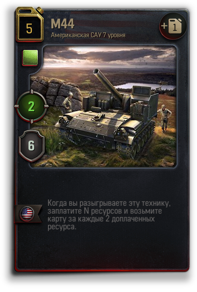 | **M44** | 7 | цена 5 · атака 2 · прочность 6 · прирост 1 | САУ | Национальная способность: Когда вы разыгрываете эту технику, заплатите N ресурсов и возьмите карту за каждые 2 доплаченных ресурса. |
| 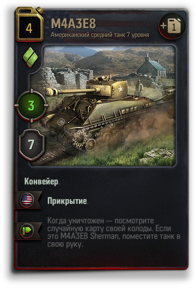 | **M4A3E8** | 7 | цена 4 · атака 3 · прочность 7 · прирост 1 | Средний танк, Конвейер | Конвейер. Национальная способность: Прикрытие. Способность активная на ударных штабах: Когда уничтожен, посмотрите случайную карту свое колоды. Если это M4A3E8 Sherman, поместите его в вашу руку. |
| 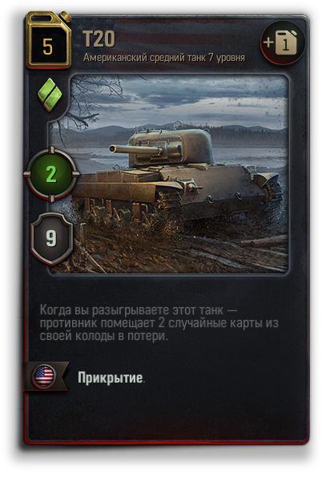 | **T20** | 7 | цена 5 · атака 2 · прочность 9 · прирост 1 | Средний танк | Когда вы разыгрываете этот танк — противник помещает 2 случайные карты из своей колоды в потери. Национальная особенность: Прикрытие |
| 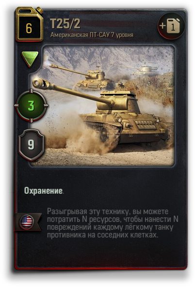 | **T25/2** | 7 | цена 6 · атака 3 · прочность 9 · прирост 1 | ПТ-САУ | Охранение. Национальная способность: Разыгрывая эту технику, вы можете потратить N ресурсов, чтобы нанести N повреждений каждому лёгкому танку противника на соседних клетках. |
| 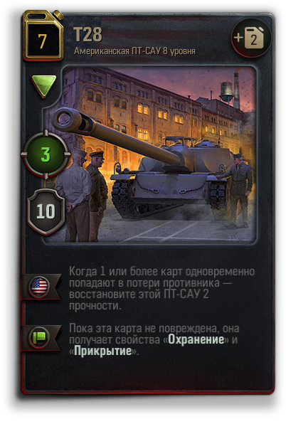 | **Т28** | 8 | цена 7 · атака 3 · прочность 10 · прирост 2 | ПТ-САУ | Национальная способность: Когда 1 или более карт одновременно попадают в потери противника — восстановите этой ПТ-САУ 2 прочности. Способность активная на свободных штабах: Пока эта карта не повреждена, она получает свойства Охранение и Прикрытие. |
| 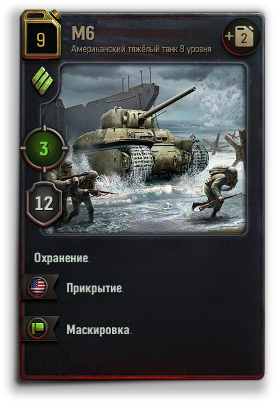 | **M6** | 8 | цена 9 · атака 3 · прочность 12 · прирост 2 | Тяжёлый танк | Охранение. Национальная способность: Прикрытие. Способность активная только на свободных штабах: Маскировка. |
| 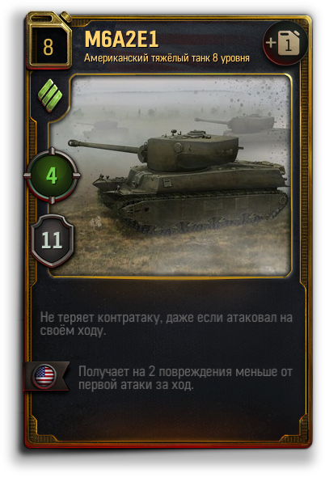 | **M6A2E1** | 8 | цена 8 · атака 4 · прочность 11 · прирост 1 | Тяжёлый танк, Премиумная | Контратакует независимо от проведённой в свой ход атаки. Национальная способность: Получает на 2 повреждения меньше от первой атаки за ход. |
| 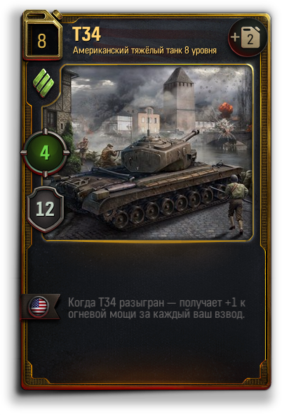 | **T34** | 8 | цена 8 · атака 4 · прочность 12 · прирост 2 | Тяжёлый танк, Премиумная | Национальная способность: Когда T34 разыгран — получает +1 к огневой мощи за каждый ваш взвод. |
| 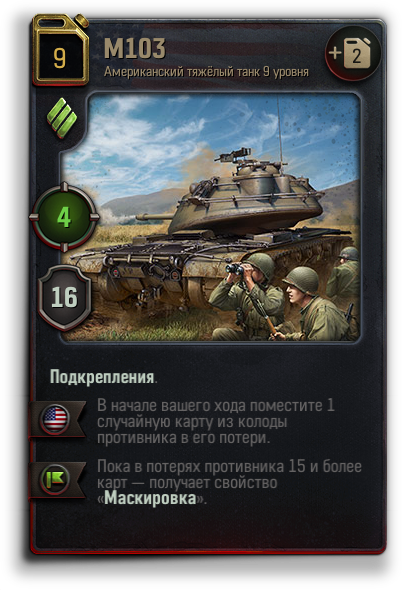 | **M103** | 9 | цена 9 · атака 4 · прочность 16 · прирост 2 | Тяжёлый танк | Подкрепления Национальная особенность: В начале вашего хода поместите 1 случайную карту из колоды противника в его потери. Способность активная на тыловых штабах: Пока в потерях противника 15 и более карт — получает свойствоМаскировка. |
| 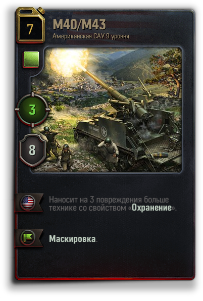 | **M40/M43** | 9 | цена 7 · атака 3 · прочность 8 · прирост 0 | САУ | Национальная способность: Наносит на 3 повреждения больше технике со способностью "Охранение". Способность активная на тыловых штабах: "Маскировка". |
| 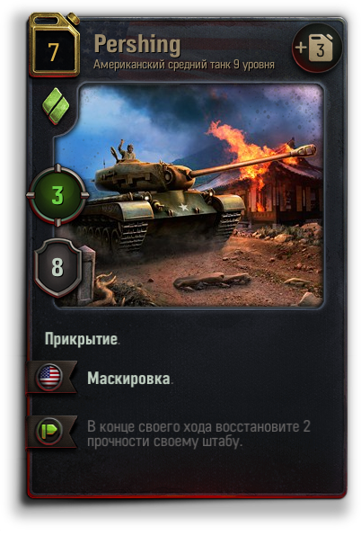 | **Pershing** | 9 | цена 7 · атака 3 · прочность 8 · прирост 3 | Средний танк | Прикрытие. Национальная способность: Маскировка. Способность активная на ударных штабах: В конце своего хода восстановите 2 прочности своему штабу. |
| 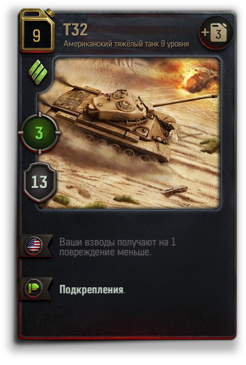 | **T32** | 9 | цена 9 · атака 3 · прочность 13 · прирост 3 | Тяжёлый танк, Наёмник | Способность активная на ударных штабах: Подкрепления. Национальная способность: Ваши взводы получают на 1 повреждение меньше. |
| 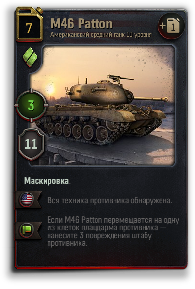 | **M46 Patton** | 10 | цена 7 · атака 3 · прочность 11 · прирост 1 | Средний танк | Маскировка. Национальная способность: Вся техника противника обнаружена. Способность активная на сводных штабах: Если M46 Patton перемещается на клетку плацдарма противника - нанесите 3 повреждения штабу противника. |
| 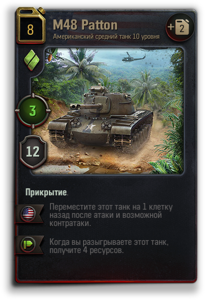 | **M48 Patton** | 10 | цена 8 · атака 3 · прочность 12 · прирост 2 | Средний танк, Наёмник | Прикрытие. Национальная особенность: Когда атакует, после боя — переместите этот танк на 1 клетку назад. Способность активная на ударных штабах: Когда вы разыгрываете этот танк, получите 4 ресурсов. |
| 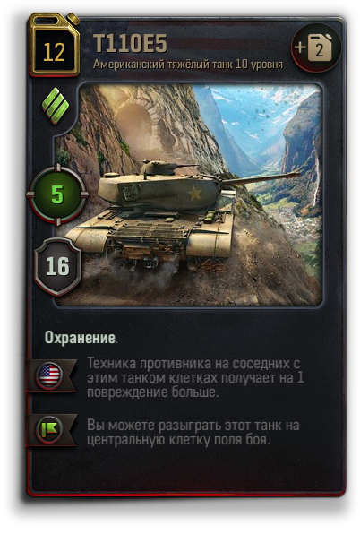 | **T110E5** | 10 | цена 12 · атака 5 · прочность 16 · прирост 2 | Тяжёлый танк | Национальная способность: Техника противника на соседних с этим танком клетках, получает на 1 повреждение больше. Способность активная на тыловых штабах: Вы можете разыграть T110E5 на центральную клетку поля боя. |
| 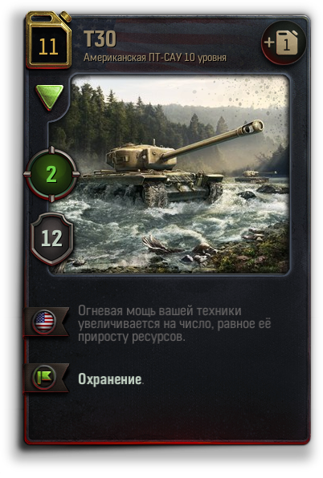 | **T30** | 10 | цена 11 · атака 2 · прочность 12 · прирост 1 | ПТ-САУ | Способность активная на тыловых штабах, всех наций: "Охранение". Национальная способность: Огневая мощь вашей техники увеличивается на число, равное её приросту ресурсов. |

## Взводы (14)

### Взводы — СССР (2)

| Арт | Карта | Ур. | Характеристики | Особенности | Способности |
| --- | --- | --- | --- | --- | --- |
| 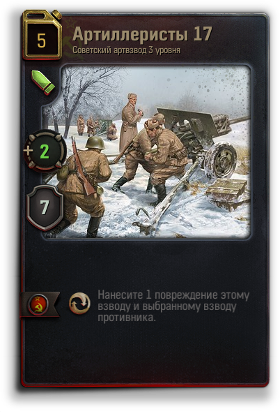 | **Артиллеристы 17** | 3 | цена 5 · атака 2 · прочность 7 · прирост 0 | Артиллеристы, атакующий | Нанесите 1 повреждение этому взводу и выбранному взводу противника (на штабах СССР). |
| 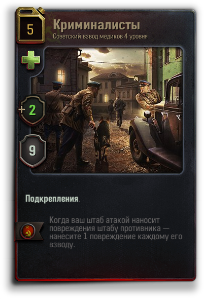 | **Криминалисты** | 4 | цена 5 · атака 2 · прочность 9 · прирост 0 | Медики, защитный | Подкрепления. Когда ваш штаб наносит повреждения штабу противника — нанесите 1 повреждение каждому его взводу (на штабах СССР). |

### Взводы — Германия (8)

| Арт | Карта | Ур. | Характеристики | Особенности | Способности |
| --- | --- | --- | --- | --- | --- |
| 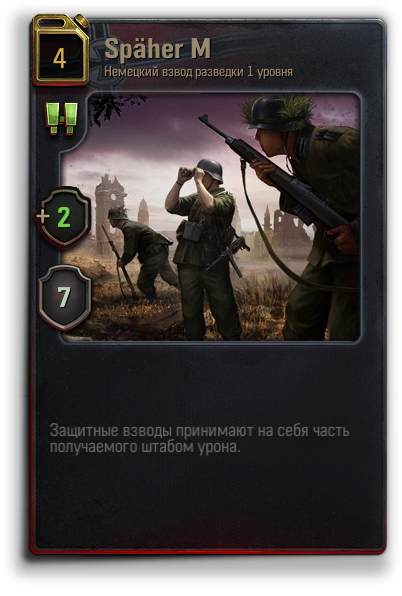 | **Späher M** | 1 | цена 4 · атака 2 · прочность 7 · прирост 0 | Разведчики, защитный, Удалена из игры | Защитные взводы принимают на себя часть получаемого штабом урона. |
| 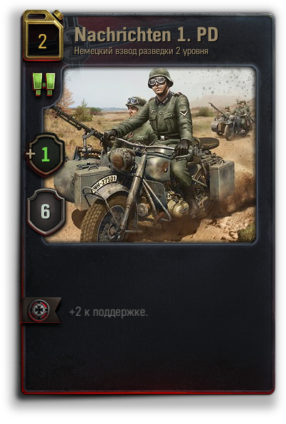 | **Nachrichten 1. PD** | 2 | цена 2 · атака 1 · прочность 6 · прирост 0 | Разведчики, защитный | (только для немецких штабов) +2 к поддержке. |
| 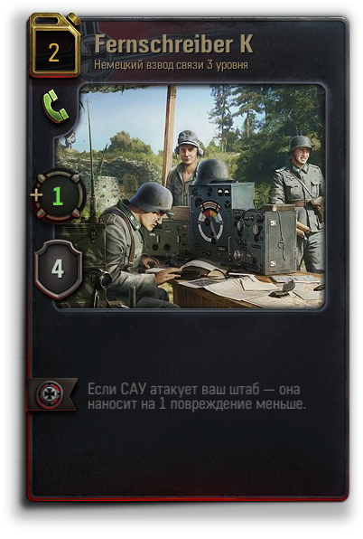 | **Fernschreiber K** | 3 | цена 2 · атака 1 · прочность 4 · прирост 0 | Связисты, атакующий | (только для немецких штабов) Если САУ атакует ваш штаб — она наносит на 1 повреждение меньше. |
| 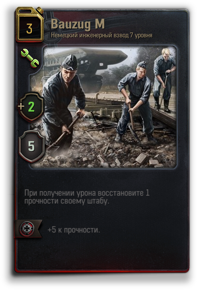 | **Bauzug M** | 4 | цена 3 · атака 2 · прочность 8 · прирост 0 | Инженеры, защитный | Когда получает повреждения - восстановите 1 прочности своему штабу. (только для немецких штабов) +5 к прочности. |
| 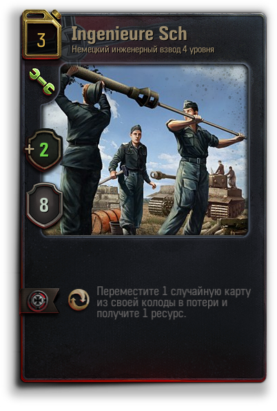 | **Ingenieure Sch** | 4 | цена 3 · атака 2 · прочность 8 · прирост 0 | Инженеры, защитный | (только для немецких штабов) Переместите 1 случайную карту из своей колоды в потери и получите 1 ресурс. |
| 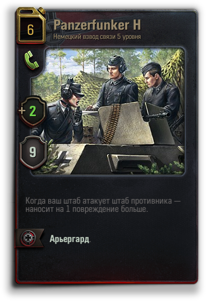 | **Panzerfunker H** | 5 | цена 6 · атака 2 · прочность 9 · прирост 0 | Связисты, защитный | Когда ваш штаб атакует штаб противника — наносит на 1 повреждение больше. (только для немецких штабов) Арьергард |
| 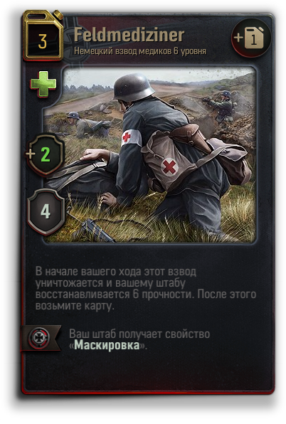 | **Feldmediziner** | 6 | цена 3 · атака 2 · прочность 4 · прирост 1 | Медики, защитный, Наёмник | В начале вашего хода этот взвод уничтожается и вашему штабу восстанавливается 6 прочности. После этого возьмите карту.. (только для немецких штабов) Ваш штаб получает способность Маскировка |
| 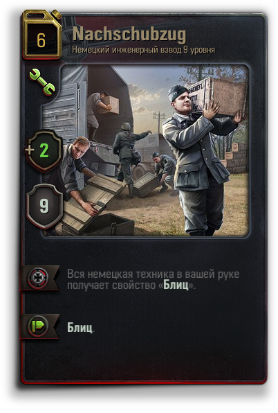 | **Nachschubzug** | 9 | цена 6 · атака 2 · прочность 9 · прирост 0 | Инженеры, защитный, Наёмник | (только для немецких штабов) Вся немецкая техника в вашей руке получает способность Блиц (только для ударных штабов) Блиц |

### Взводы — США (4)

| Арт | Карта | Ур. | Характеристики | Особенности | Способности |
| --- | --- | --- | --- | --- | --- |
| 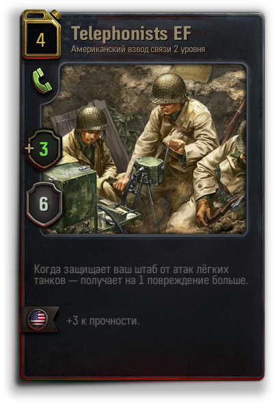 | **Telephonists EF** | 2 | цена 4 · атака 3 · прочность 6 | Связисты, защитный | Когда защищает ваш штаб от атак лёгких танков - получает на 1 повреждение больше. Национальная способность: +3 к прочности взвода. |
| 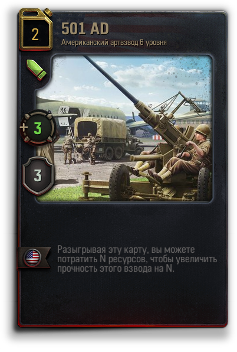 | **501 AD** | 6 | цена 2 · атака 3 · прочность 3 | Артиллеристы, атакующий | Разыгрывая эту карту вы можете потратить N единиц ресурсов, чтобы этот взвод получил N единиц к прочности. |
| 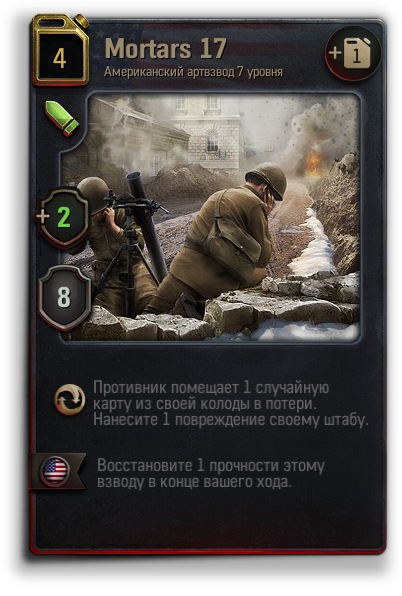 | **Mortars 17** | 7 | цена 4 · атака 2 · прочность 8 · прирост 1 | Артиллеристы, защитный | Противник помещает 1 случайную карту из своей колоды в потери. Нанесите 1 повреждение своему штабу. Национальная способность: Восстановите 1 прочности этому взводу в конце вашего хода. |
| 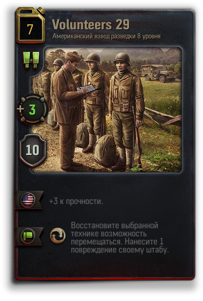 | **Volunteers 29** | 8 | цена 7 · атака 3 · прочность 10 | атакующий | Национальная способность: +3 к прочности. Способность активная на свободных штабах: Восстановите выбранной технике возможность перемещаться. Нанесите 1 повреждение своему штабу. |

## Приказы (14)

### Приказы — СССР (1)

| Арт | Карта | Ур. | Характеристики | Особенности | Способности |
| --- | --- | --- | --- | --- | --- |
| 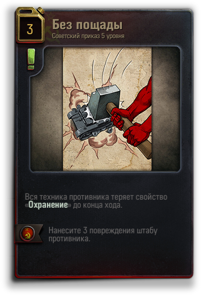 | **Без пощады** | 5 | цена 3 | Наёмник | Вся техника противника теряет свойство Охранение до конца хода. (только для советских штабов) Нанесите 3 повреждения штабу противника |

### Приказы — Германия (8)

| Арт | Карта | Ур. | Характеристики | Особенности | Способности |
| --- | --- | --- | --- | --- | --- |
| 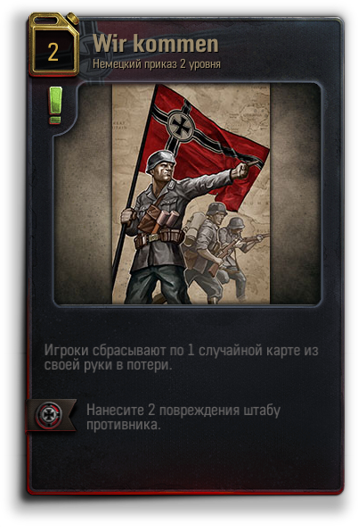 | **Wir kommen** | 2 | цена 2 | — | Игроки сбрасывают по 1 случайной карте из своей руки в потери. (только для немецких штабов) Нанесите 2 повреждения штабу противника. |
| 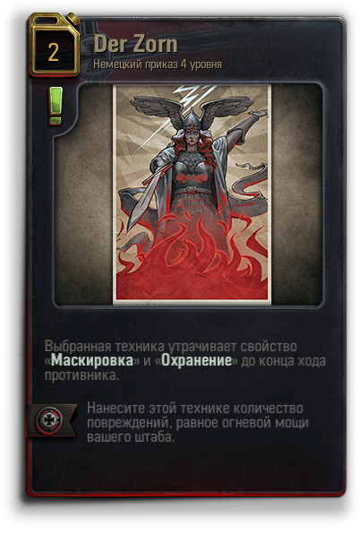 | **Der Zorn** | 4 | цена 2 | — | Выбранная техника утрачивает способность Маскировка и Охранение до конца хода противника. (только для немецких штабов) Нанесите этой технике количество повреждений, равное огневой мощи вашего штаба. |
| 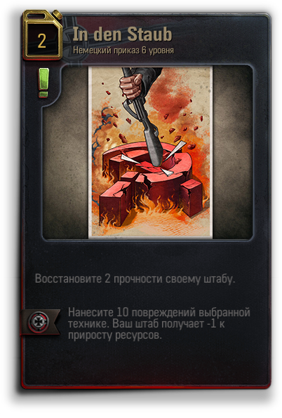 | **In den Staub** | 6 | цена 2 | Наёмник | Восстановите 2 прочности своему штабу. (только для немецких штабов) Нанесите 10 повреждений выбранной технике. Ваш штаб получает -1 к приросту ресурсов. |
| 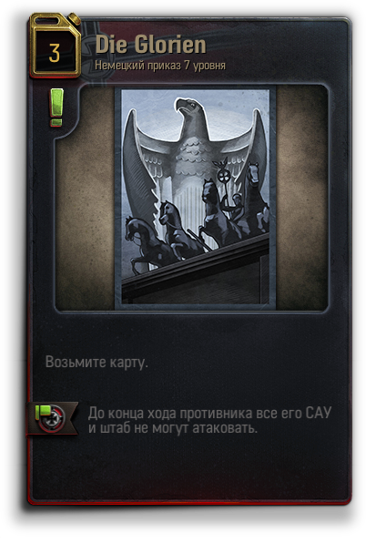 | **Die Glorien** | 7 | цена 3 | — | Возьмите карту. (только для немецких сводных штабов) До конца хода противника все его САУ и штаб не могут атаковать. |
| 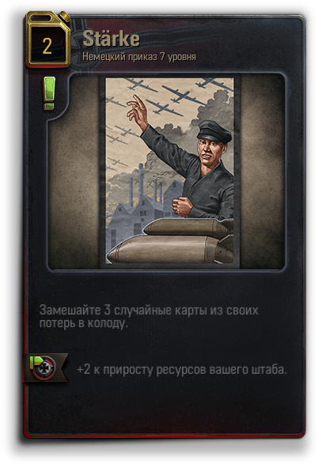 | **Stärke** | 7 | цена 2 | — | Замешайте 3 случайные карты из своих потерь в колоду. (только для немецких ударных штабов) +2 к приросту ресурсов вашего штаба. |
| 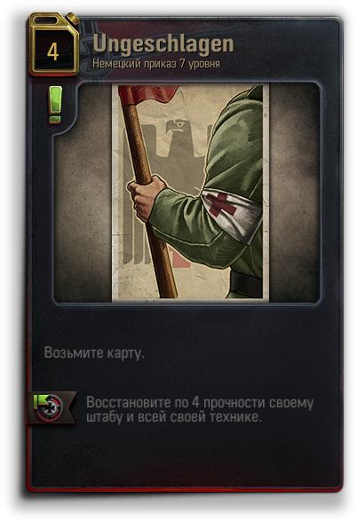 | **Ungeschlagen** | 7 | цена 4 | — | Возьмите карту. (только для немецких тыловых штабов) Восстановите по 4 прочности своему штабу и всей своей технике. |
| 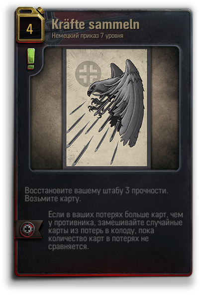 | **Zweiter Wind** | 7 | цена 4 | Наёмник | Восстановите 3 прочности своему штабу. Возьмите карту (только для немецких штабов) Если у вас в потерях больше карт, чем у противника — замешивайте случайные карты из своих потерь в колоду, пока количество карт в потерях не сравняется. |
| 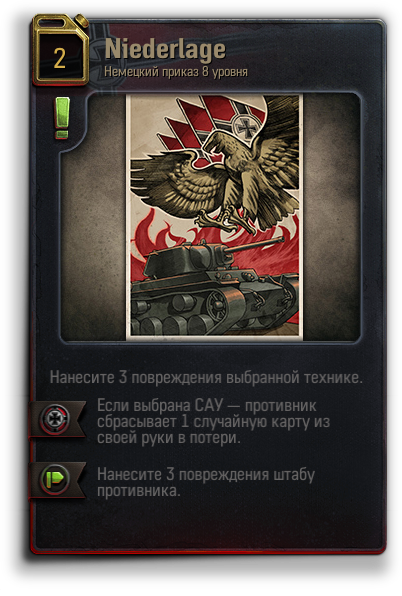 | **Niederlage** | 8 | цена 2 | — | Нанесите 3 повреждения выбранной технике. (только для немецких штабов) Если выбрана САУ — противник сбрасывает 1 случайную карту из своей руки в потери. (только для ударных штабов) Нанесите 3 повреждения штабу противника. |

### Приказы — США (5)

| Арт | Карта | Ур. | Характеристики | Особенности | Способности |
| --- | --- | --- | --- | --- | --- |
| 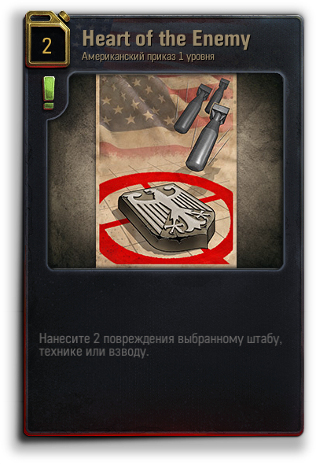 | **Heart of the Enemy** | 1 | цена 2 | Стартовая | Нанесите 2 повреждения выбранному штабу, технике или взводу. |
| 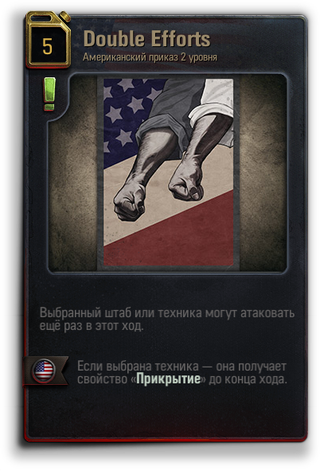 | **Double Efforts** | 2 | цена 5 | — | Выбранная техника или штаб могут атаковать еще раз в этот ход. Национальная способность: Если выбрана техника, то она получает свойство "Прикрытие" до конца хода. |
| 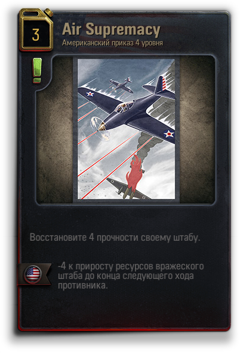 | **Air Supremacy** | 4 | цена 3 | — | Восстановите 4 прочности своему штабу. Национальная способность: -4 к приросту вражеского штаба до конца следующего хода противника. |
| 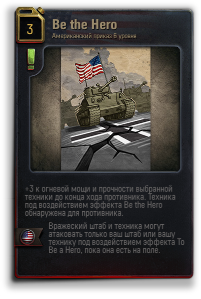 | **Be the Hero** | 6 | цена 3 | Наёмник | +3 к огневой мощи и прочности выбранной техники до конца хода противника. Эта техника обнаружена для противника в его следующий ход. Национальная способность: В следующий ход противника, пока техника, выбранная Freedom, остается на поле боя - вражеский штаб и техника могут атаковать только ваш штаб или такую технику. |
| 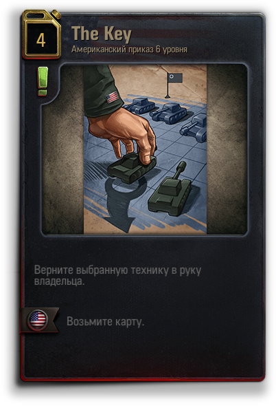 | **The Key** | 6 | цена 4 | Наёмник | Верните выбранную технику в руку владельца . Национальная способность: Возьмите карту. |
